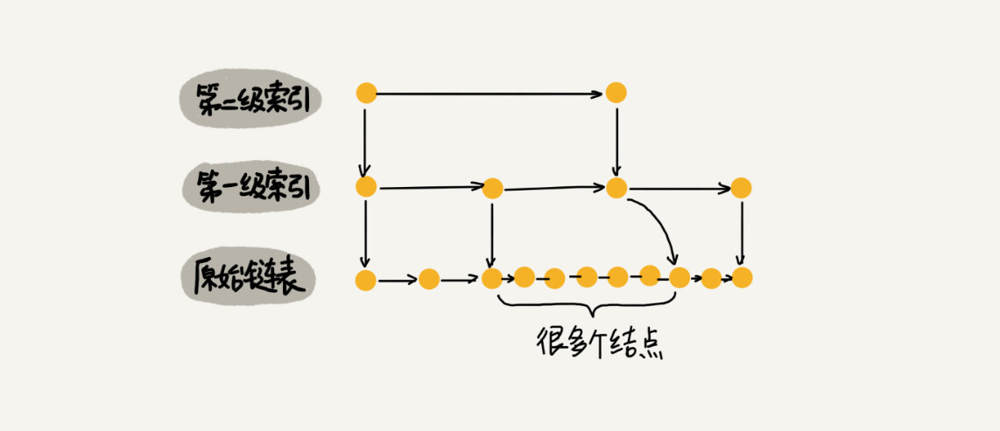
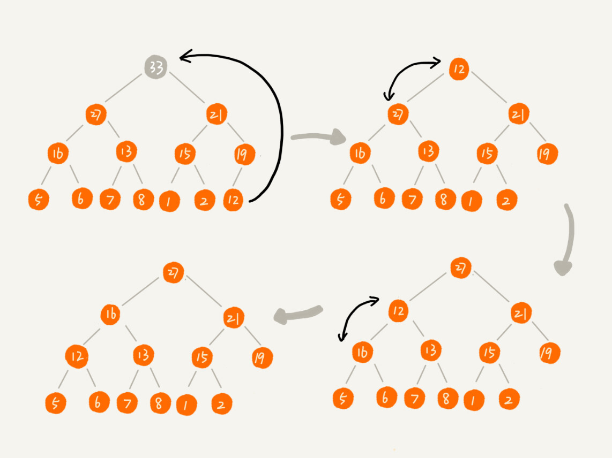
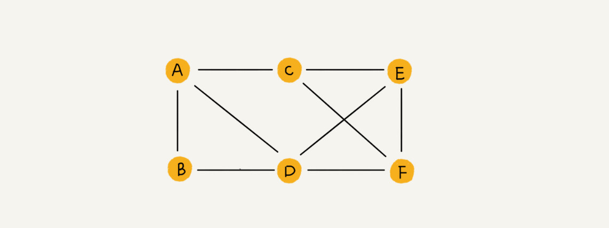
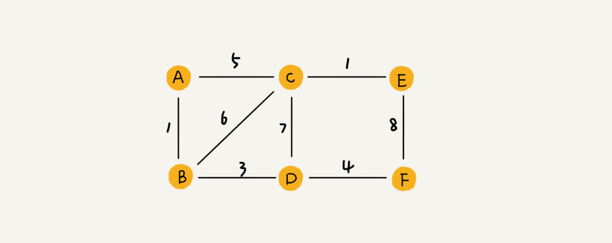
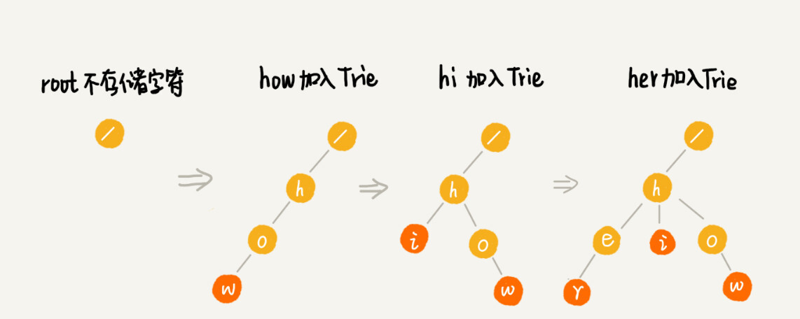
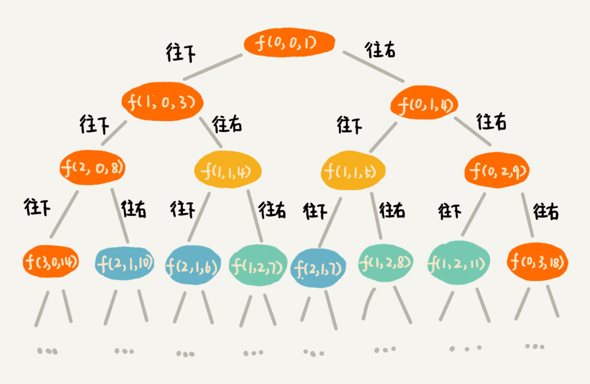
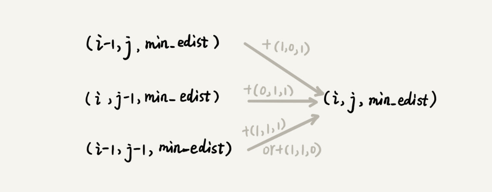

# 必须掌握的20种数据结构和算法

数据结构：数组、链表、栈、队列、散列表、二叉树、堆、跳表、图、Tire树
算法： 递归、排序、二分查找、搜索、哈希算法、贪心算法、分治算法、回溯算法、动态规划、字符串匹配算法


数据结构可视化：https://www.cs.usfca.edu/~galles/visualization/Algorithms.html（对于理解不了的算法可以到这里理解）


# 冒泡排序，插入排序，选择排序

```java
/**
 * 算法联系
 * https://static001.geekbang.org/resource/image/34/50/348604caaf0a1b1d7fee0512822f0e50.jpg
 * 冒泡：https://static001.geekbang.org/resource/image/a9/e6/a9783a3b13c11a5e064c5306c261e8e6.jpg
 * 插入：https://static001.geekbang.org/resource/image/7b/a6/7b257e179787c633d2bd171a764171a6.jpg
 * 选择：https://static001.geekbang.org/resource/image/32/1d/32371475a0b08f0db9861d102474181d.jpg
 * @author pwx
 */
public class Solution {
    /**
     * 冒泡排序
     * 时间复杂度：O(n^2)
     * 空间复杂度：O(1)
     * 稳定
     * @param a -
     * @param n -
     */ 
    public static void bubbleSort(int[] a, int n) {
        if (n<=1){ return; }
        for (int i = 0; i < n; i++) {
            boolean flag = false;
            for (int j =0 ; j < n-i-1 ; j++) {
                if (a[j] > a[j + 1]){
                    int temp = a[j];
                    a[j] = a[j + 1];
                    a[j + 1] = temp;
                    flag = true;
                }
            }
            if (!flag) {break;}
        }
    }

    /**
     * 插入排序
     * 性能比冒泡优秀，只需要进行一次赋值操作，用的比较多
     * 时间复杂度：O(n^2)
     * 空间复杂度：O(1)
     * 稳定
     * @param a -
     * @param n -
     */
    public static void insertionSort(int[] a, int n) {
        if (n <= 1){return;}
        for (int i = 1; i < n ; i++) {
            int value = a[i];
            int j = i - 1;
            for (; j >= 0 ; j--) {
                if (value > a[j]){
                    a[j+1] = a[j];
                }else {
                    break;
                }
            }
            a[j+1] = value;
        }
    }

    /**
     * 选择排序
     * 时间复杂度：O(n^2)
     * 空间复杂度：O(1)
     * 不稳定
     * @param a -
     * @param n -
     */
    public static void selectionSort(int[] a, int n) {
        if (n <= 1) { return; }
        for (int i = 0; i < n; i++) {
            int tmp = i;
            int min = a[i];
            int j = i + 1;
            for (; j < n ; j++) {
                if (min > a[j]){
                    min = a[j];
                    tmp = j;
                }
            }
            a[tmp] = a[i];
            a[i] = min;
        }
    }

    public static void main(String[] args) {
        int[] a = {4,5,6,1,3,2};
        insertionSort(a,a.length);
        bubbleSort(a,a.length);
        selectionSort(a,a.length);
        System.out.println(Arrays.toString(a));
    }
}

```


# 归并排序，快速排序


> 归并排序

```java
/**
 * 归并排序
 * 时间复杂度：
 * T(n) = 2*T(n/2) + n 
 *      = 2*(2*T(n/4) + n/2) + n 
 *      = 4*T(n/4) + 2*n 
 *      = 4*(2*T(n/8) + n/4) + 2*n
 *      = 8*T(n/8) + 3*n 
 *      = 8*(2*T(n/16) + n/8) + 3*n 
 *      = 16*T(n/16) + 4*n ...... 
 *      = 2^k * T(n/2^k) + k * n ......
 *  n/2^k = 1,k=log2n,
 *  所以为 O(nlogn)
 *  空间复杂度：O(n)
 * @author pwx
 */
public class Solution {

    private void sort(int[] a,int left,int right){
        if (left >= right){return;}
        int min = (right + left) / 2;
        sort(a,left,min);
        sort(a,min+1,right);
        merge(a,left,min,right);
    }

    private void merge(int[] a, int left, int min, int right) {
        int[] c = new int[right - left + 1];
        int i = 0 , j = left, k = min + 1;
        while (j <= min && k <= right){
            if (a[j] < a[k]){
                c[i++] = a[j++];
            }else {
                c[i++] = a[k++];
            }
        }

        while (j <= min){
            c[i++] = a[j++];
        }

        while (k <= right){
            c[i++] = a[k++];
        }

        for (int value : c) {
            a[left++] = value;
        }
    }

    public static void main(String[] args) {
        Solution solution = new Solution();
        int[] a = {4,5,6,1,3,2};
        solution.sort(a,0, a.length-1);
        System.out.println(Arrays.toString(a));
    }
}
```


> 快速排序

```java
/**
 * 快速排序
 * 时间复杂度：和归并一样，O（nlogn），极端情况会变成O(n^2)
 * 空间复杂度：O(1) -> 原地
 * 不稳定
 * 三数取中法，随机法
 * @author pwx
 */
public class Solution {

    private void quickSort(int[] a,int left,int right){
        if (left >= right){return;}
        int partition = partition(a,left,right);
        quickSort(a,left,partition-1);
        quickSort(a,partition + 1,right);
    }

    private int partition(int[] a, int left, int right) {
        int pivot = a[right];
        int i = left;
        for (int j = left; j < right; j++) {
            if (a[j] < pivot){
                int temp = a[j];
                a[j] = a[i];
                a[i++] = temp;
            }
        }
        a[right] = a[i];
        a[i] = pivot;
        return i;
    }


    public static void main(String[] args) {
        Solution solution = new Solution();
        int[] a = {4,5,6,1,3,2};
        solution.quickSort(a,0, a.length-1);
        System.out.println(Arrays.toString(a));
    }

}
```

```java
/**
  *  如何在 O(n) 的时间复杂度内查找一个无序数组中的第 K 大元素
  */
public class kthMax {

    public static int kthMax(int[] arr, int k) {
        if (arr == null || arr.length < k) {
            return -1;
        }

        int partition = partition(arr, 0, arr.length - 1);
        while (partition + 1 != k) {
            if (partition + 1 < k) {
                partition = partition(arr, partition + 1, arr.length - 1);
            } else {
                partition = partition(arr, 0, partition - 1);
            }
        }

        return arr[partition];
    }

    private static int partition(int[] arr, int p, int r) {
        int pivot = arr[r];

        int i = p;
        for (int j = p; j < r; j++) {
            if (arr[j] > pivot) {
                swap(arr, i, j);
                i++;
            }
        }

        swap(arr, i, r);

        return i;
    }

    private static void swap(int[] arr, int i, int j) {
        if (i == j) {
            return;
        }

        int tmp = arr[i];
        arr[i] = arr[j];
        arr[j] = tmp;
    }


    public static void main(String[] args) {
        int[] arr = {6, 1, 3, 5, 7, 2, 4, 9, 11, 8};
        System.out.println(kthMax(arr, 5));
    }

}
```


# 桶排序，计数排序，基数排序

> 桶排序（Bucket sort）


时间复杂度：

​	如果要排序的数据有 n 个，我们把它们均匀地划分到 m 个桶内，每个桶里就有 k=n/m 个元素。每个桶内部使用快速排序，时间复杂度为 O(k * logk)。m 个桶排序的时间复杂度就是 O(m * k * logk)，因为 k=n/m，所以整个桶排序的时间复杂度就是 O(n*log(n/m))。当桶的个数 m 接近数据个数 n 时，log(n/m) 就是一个非常小的常量，这个时候桶排序的时间复杂度接近 O(n)。

问题：条件苛刻，数据无法均匀分布

适用场景：外部排序，数据量够大的时候

例子：


> 计数排序（Counting sort）

计数排序是桶排序的一种特殊情况

计数排序只能用在数据范围不大的场景中，如果数据范围 k 比要排序的数据 n 大很多，就不适合用计数排序了。而且，计数排序只能给非负整数排序，如果要排序的数据是其他类型的，要将其在不改变相对大小的情况下，转化为非负整数。


```java

// 计数排序，a是数组，n是数组大小。假设数组中存储的都是非负整数。
public void countingSort(int[] a, int n) {
  if (n <= 1) return;

  // 查找数组中数据的范围
  int max = a[0];
  for (int i = 1; i < n; ++i) {
    if (max < a[i]) {
      max = a[i];
    }
  }

  int[] c = new int[max + 1]; // 申请一个计数数组c，下标大小[0,max]
  for (int i = 0; i <= max; ++i) {
    c[i] = 0;
  }

  // 计算每个元素的个数，放入c中
  for (int i = 0; i < n; ++i) {
    c[a[i]]++;
  }

  // 依次累加
  for (int i = 1; i <= max; ++i) {
    c[i] = c[i-1] + c[i];
  }

  // 临时数组r，存储排序之后的结果
  int[] r = new int[n];
  // 计算排序的关键步骤，有点难理解
  for (int i = n - 1; i >= 0; --i) {
    int index = c[a[i]]-1;
    r[index] = a[i];
    c[a[i]]--;
  }

  // 将结果拷贝给a数组
  for (int i = 0; i < n; ++i) {
    a[i] = r[i];
  }
}
```


> 基数排序（Radix sort）

当范围太大的时候，前两种排序方式就不适用了，这时候就可以用上基数排序

先按照最后一位来排序手机号码，然后再按照倒数第二位重新排序，知道按照第一位。

按照每一位来排序的算法是要稳定的，否则这个思路就是不正确的。

时间复杂度：

​	根据每一位排序，我们可以用刚讲过的桶排序或者计数排序，他们的时间复杂度可以做到O(n)，如果有k位，时间复杂度就是O(k*n)，当k不大的时候，时间复杂度就近似于O(n)

如果位数不够，可以在后面补“0”。因为根据ASCII 值，所有字母都大于“0”，所以补“0”不会影响到原有的大小顺序。这样就可以继续用基数排序了。

总结：基数排序对要排序的数据是有要求的，需要可以分割出独立的“位”来比较，而且位之间有递进的关系，如果 a 数据的高位比 b 数据大，那剩下的低位就不用比较了。除此之外，每一位的数据范围不能太大，要可以用线性排序算法来排序，否则，基数排序的时间复杂度就无法做到 O(n) 了。解答开篇


> 举例分析排序函数

Glibc 中的 qsort() 函数

qsort()会优先使用归并排序来排序输入数据，对于小数据量的排序，归并排序额外需要的空间问题不大，但是速度会快很多

如果数据量大了，就使用快速排序算法来排序，看源码，其实很容易就看出qsort() 选择分区点的方法就是“三数取中法”

在快速排序的过程中，当要排序的区间中，元素的个数小于等于 4 时，qsort() 就退化为插入排序，不再继续用递归来做快速排序，因为我们前面也讲过，在小规模数据面前，O(n2) 时间复杂度的算法并不一定比 O(nlogn) 的算法执行时间长。

用哨兵简化代码，每次排序都减少一次判断，尽可能把性能优化到极致


# 二分查找

时间复杂度：O(logn)

>非递归实现

```java
class Solution{
    public int bsearch(int[] a, int n, int value) {
        if(n < 1){return -1;}
        if(n == 1 && a[0] == value){return 0;}
        int low = 0;
        int high = n-1;
        while(low <= high){
            int mid = low + (high - low) >> 1;
            if(a[mid] == value){
                return mid;
            }else if(a[mid] > value){
                high = mid - 1;
            }else if(a[mid] < value){
                low = mid + 1;
            }
        }
        //没有找到的话，返回-1
        return -1;
    }
}
```


> 递归实现

```java
class Solution{
     public int bsearch(int[] a, int left,int right, int value) {
         if(left > right){return -1;}
         int mid = left + (right - left) >> 1;
         if(a[mid] == value){
             return mid;
         }else if(a[mid] < value){
             bsearch(a , left , mid - 1 , value);
         }else if(a[mid] > value){
             bsearch(a , mid + 1 , right , value);
         }
     }
}
```


局限性：

- 二分法查找依赖的是顺序表的结构，也就是数组，不适合链表
- 同时因为依赖的是数组，需要很大的连续的空间，所以对于数据量太大的数据集不合适
- 二分查找针对的是有序数据，所以查找之前需要进行排序，对于插入少和删除少的数据，只需要排一次之后就可以直接使用了，对于插入多和删除多的数据，每次查找都要重新进行排序，会造成很大的成本。
- 如果数据之间的比较操作非常耗时，无论数据大小，都推荐使用二分查找


二分查找变形问题：

- 查找第一个值等于给定值的元素

```java
class Solution{
    public int bsearch(int[] a, int n, int value) {
        if(n < 1){return -1;}
        if(n == 1 && a[0] == value){return 0;}
        int low = 0;
        int high = n-1;
        while(low <= high){
            int mid = low + (high - low) >> 1;
            if(a[mid] > value){
                high = mid - 1;
            }else if(a[mid] < value){
                low = mid + 1;
            }else {
                if(mid == 0 || a[mid - 1] != value) {
                return mid;
            	}else {high = mid - 1;}
            }
        }
        //没有找到的话，返回-1
        return -1;
    }
}
```


- 查找最后一个等于给定值的元素

```java
class Solution{
    
    public int bsearch(int[] a, int n, int value) {
      int low = 0;
      int high = n - 1;
      while (low <= high) {
        int mid =  low + ((high - low) >> 1);
        if (a[mid] > value) {
          high = mid - 1;
        } else if (a[mid] < value) {
          low = mid + 1;
        } else {
          if ((mid == n - 1) || (a[mid + 1] != value)) return mid;
          else low = mid + 1;
        }
      }
      return -1;
    }
}
```


- 查找第一个大于等于给定值的元素

```java
class Solution{
    
    public int bsearch(int[] a, int n, int value) {
        int low = 0;
        int high = n - 1;
        while (low <= high) {
            int mid =  low + ((high - low) >> 1);
            if (a[mid] >= value) {
                if ((mid == 0) || (a[mid - 1] < value)) return mid;
                else high = mid - 1;
            } else {
                low = mid + 1;
            }
        }
        return -1;
    }
}
```


- 查找第一个小于等于给定值的元素

```java

public int bsearch(int[] a, int n, int value) {
  int low = 0;
  int high = n - 1;
  while (low <= high) {
    int mid =  low + ((high - low) >> 1);
    if (a[mid] >= value) {
      if ((mid == 0) || (a[mid - 1] < value)) return mid;
      else high = mid - 1;
    } else {
      low = mid + 1;
    }
  }
  return -1;
}
```


# 跳表

对链表进行二分法查找

Redis中的有序集合（Sorted Set）就是用跳表来实现的。

这里有一个问题：**相比于红黑树，跳表有什么好处**

对链表进行查找，只能通过遍历每一个节点，这个时间复杂度是O(n)，这是我们不能接受的。

但是如果这个时候我们对链表建立一级索引，每两个节点提取一个节点到上一级，我们把抽出来的那一级索引叫做索引或索引层。


通过这样一个索引，我们可以很大的提高我们的查找效率。

当然，随着数据量的不断提升，我们添加的索引层越多，查找的效率越高


> 时间复杂度计算

假设我们按照每两个节点就提出一个节点作为索引，那么第一级索引的结点个数大概就是n/2，第二层就是n/4，所以第 k级索引结点的个数就是 n/(2^k)。

假设有h级，最高级的索引有2个节点。通过上面的公式，我们可以得到 n/2^h=2 ，得到h=log2n -1，加上最开始的那一层，就是log2n层。我们在跳表中查询某个数据的时候，如果每一层都要遍历 m 个结点，那在跳表中查询一个数据的时间复杂度就是 O(m*logn)。这个m在这里是3。

所以算下来，我们可以得到，跳表的时间复杂度为O（logn）。

当然，这是很典型的空间换时间。

> 空间复杂度

假设我们按照每两个节点就提出一个节点作为索引


这么算下来，跳表的空间复杂度就是O（n），当然如果每三个节点甚至多个节点再提出一个节点作为索引，那这个空间复杂度就会变得更少。

但在实际软件开发中，我们不必太在意索引占用的空间，在实际开发中我们往往存的都是对象，特别是如果对象特别大，那我们只需要存一些关键值和几个指针，那这一部分用来存索引的空间就可以忽略不计了。


> 插入和删除

插入和删除其实我们可以很好理解


但是当插入的数据越来越多的时候，就可能出现某两个节点之间数据非常多的情况。极端情况下，跳表还会退化成单链表。



这在红黑树，平衡二叉树中也会出现这样的问题，但是他们有通过左右旋的方式来保持左右子树的大小平衡。而跳表是通过随机函数来维护他的平衡性。

当我们往跳表中插入数据的时候，我们可以选择同时将这个数据插入到部分索引层中。如何选择加入哪些索引层呢？

我们通过一个随机函数，来决定将这个结点插入到哪几级索引中，比如随机函数生成了值 K，那我们就将这个结点添加到第一级到第 K 级这 K 级索引中。


这就是跳表了，那么我们回过头来看看，为什么Redis的有序集合是通过跳表来实现的。

Redis的有序集合支持的核心操作主要有下面几个：

- 插入数据
- 删除数据
- 查找数据
- 按照区间查找数据
- 迭代输出有序序列

其中，插入、删除、查找以及迭代输出有序序列这几个操作，红黑树也可以完成，时间复杂度跟跳表是一样的。但是，按照区间来查找数据这个操作，红黑树的效率没有跳表高。


# 构造散列函数的六种方法

https://blog.csdn.net/liu17234050/article/details/104270709


何为一个工业级的散列表？工业级的散列表应该具有哪些特性？

- 支持快速地查询、插入、删除操作；
- 内存占用合理，不能浪费过多的内存空间；
- 性能稳定，极端情况下，散列表的性能也不会退化到无法接受的情况。

如何实现这样一个散列表呢？

- 设计一个合适的散列函数；
- 定义装载因子阈值，并且设计动态扩容策略；
- 选择合适的散列冲突解决方法。 


# LRU缓存算法

```java
class Node {
    int key;
    int value;
    Node pre;
    Node next;
 
    public Node(int key, int value){
        this.key = key;
        this.value = value;
    }
}

public class LRUCache {
    int capacity;
    Map<Integer, Node> map = new HashMap<>();
    Node head = null;
    Node end = null;
    
    public LRUCache(int capacity){
        this.capacity = capacity;
    }
    
    public int get(int key){
        if(map.containsKey(key)){
            Node n = map.get(key);
            remove(n);
            setHead(n);
            return n.value;
        }
    }
    
    public void set(int key, int value){
        if(map. containsKey(key)){
            Node oldNode = map.get(key);
            oldNode.value = value;
            remove(oldNode);
            setHead(oldNode);
        }else {
            Node newNode = new Node(key,value);
            if(map.size() >= capacity){
                map.remove(end.key);
                remove(end);   
            }
            setHead(newNode);
            map.put(key,newNode);
        }
    }
    
    public void remove(Node n){
        if(n.pre != null){
            n.pre.next = n.next;
        }else{
            head = n.next;
        }
        
        if(n.next != null){
            n.next.pre = n.pre;
        }else{
            n.pre.next = end;
        }
    }
    
    public void setHead(Node n){
        n.next = head;
        n.pre = null;
        
        if(head != null){
            head.pre = n;
            head = n;
        }
        
        if(end == null){
            end = head;
        }
    }
}
```


# 哈希算法

将任意长度的二进制值串映射为固定长度的二进制串，这个映射的规则就是哈希算法

一个优秀的哈希算法要满足一下几点：

- 从哈希值不能反向推导出原始数据（所以哈希算法又称为单向哈希算法）
- 对输入数据非常敏感，哪怕只修改了一个Bit，最后得到的值也大不相同
- 散列冲突的概率很小，对于不同的原始数据，哈希值相同的概率非常小
- 哈希算法的执行效率要尽量高效，针对较长的文本，也能快速算出哈希值

比如MD5

哈希算法的7个常见应用

- 安全加密
- 唯一标识
- 数据校验
- 散列函数
- 负载均衡
- 数据分片
- 分布式存储

前四个没什么好说的，我们来看看后面三个

> 负载均衡

负载均衡的算法有很多 ，但是如果在一个会话里面对服务器发请求的时候被均衡到多个服务器，往往就会导致出现一些问题，所以我们要实现会话粘滞。

我们可以通过哈希算法，对客户端 IP 地址或者会话 ID 计算哈希值，将取得的哈希值与服务器列表的大小进行取模运算，最终得到的值就是应该被路由到的服务器编号。这比我们直接去维护一个映射关系表要好很多。

> 数据分片

其实和负载均衡是一个道理，都是通过哈希计算计算出哈希值，然后通过取模分配到不同的机子上，得到分页的结果

比如统计“搜索关键词”出现的次数，我们用n台机器并行处理，从搜索记录的日志文件中，一次读出每一个搜索关键词，并通过哈希函数计算哈希值，然后再跟n取模，最终得到的值，就是应该被分配到的机器的编号。


> 分布式存储

缓存的时候，我们往往也需要将数据分布在多台机器上，我们也可以通过哈希算法对数据取哈希值然后取模，获取要存的机器的编号

这时候，如果机器都满了，需要再添加几个机器，这时候我们的之前所有的数据都要重新进行存储，就很容易导致缓存击穿，出现雪崩效应

这时候我们需要一种方法，使得在新加入一个机器后，并不需要做大量的数据迁移，这个时候，就要用我们的一致性哈希算法了。

一致性算法：https://www.zsythink.net/archives/1182

假设我们有k个机器，数据的哈希值的范围是在【0，MAX】。我们将整个范围划分成m个小区间（m远大于k）。每个机器负责 m/k 个小区间。当有新机器加入的时候，我们就将某几个小区间的数据，从原来的机器中搬移到新的机器中。这样，既不用全部重新哈希、搬移数据，也保持了各个机器上数据数量的均衡。


# 红黑树

来源：https://www.cnblogs.com/tiancai/p/9072813.html


# 堆

堆就是一个完全二叉树，分为大顶堆和小顶堆

堆可以直接用数组存储


数组中下标为 i 的节点的左子节点，就是下标为 i∗2 的节点，右子节点就是下标为 i∗2+1 的节点，父节点就是下标为 2i 的节点。

> 插入

 堆化是指在插入一个新的元素之后，，堆不再符合堆的特性了，这时候就需要做调整，这个过程就是堆化了

堆化分为从下到上和从上到下，比如我们现在加入22这个值


> 删除

如果直接从上删除到下，会导致最后堆化出来的堆不满足完全二叉树的特性


所以，我们换一个思路

我们把最后一个节点放在堆顶，然后利用同样的父子节点对比方法进行堆化，就完成了删除操作




> 堆排序

堆排序的过程大致分解成两个大的步骤，建堆和排序。

1、建堆

建堆有两种思路：

- 和插入元素一个思路，将下标从2到n的数据依次插入到堆中，这样我们就将包含n个数据的数组组成了堆，这是一种从下到上的操作

- 从后往前进行处理，并且每一个数据都是从上往下堆化，因为叶子节点只能和自己比较，所以我们直接从最后一个非叶子节点开始，依次堆化

  


我们可以很清楚的看到，从n / 2 + 1 到 n都是叶子节点

这里有一个小问题，每一个节点堆化的时间复杂度是O（logn），那n / 2个节点堆化的总时间复杂度就是O（nlogn）

但实际上，堆排序的建堆过程时间复杂度是O（n），我们来分析一下

因为叶子节点不需要堆化，所以需要堆化的节点从倒数第二层开始，每个节点堆化的过程中，需要比较和交换的节点的个数，和这个节点的高度h成正比。


我们将每一个非叶子节点的高度求和


因为 h=log2n，代入公式 S，就能得到 S=O(n)，所以，建堆的时间复杂度就是 O(n)。


2、 排序

建堆结束之后，数组中的数据已经是按照大顶堆的特性了，数组中的第一个元素就是堆顶，也就是最大的元素。我们把它跟最后一个元素交换，那最大元素就放到了下标为 n 的位置。

排序的过程其实有点像删除堆顶元素的操作，我们把堆顶元素移除之后，将下标为n的元素放到堆顶，然后剩下的 n−1 个元素在通过堆化之后将堆顶放到n -1的位置，一直重复这个过程，排序就完成了


> 堆排序和快速排序

通常情况，堆排序不如快速排序

- 堆排序在范围节点的时候是跳着访问的，对比的时候是跳着对比的，这相比于快速排序访问连续的内存来说要慢一些
- 堆排序在排序的过程中节点之间交换的次数要高于快速排序


```java
/**
 * 堆
 */
class Heap{
    private int[] a;
    private int n;
    private int count;

    public Heap(int capacity){
        a = new int[capacity];
        n = capacity;
        count = 0;
    }

    /**
     * 插入
     * @param data 要插入的数据
     */
    public void insert(int data){
        if(count == n){return;}
        count ++;
        a[count] = data;
        int k = count;
        while (k > 0 && a[k] > a[k >> 1]){
            swap(a,k,k / 2);
            k = k >> 1;
        }
    }

    /**
     * 删除堆顶元素
     */
    public void deleteMax(int[] a,int n){
        if(n < 1){return;}
        a[1] = a[count];
        count --;
        heapify(a,count,1);
    }

    /**
     * 排序
     */
    public void sort(int[] a, int n){
        buildHeap(a,n);
        int k = count;
        while(k > 0){
            swap(a,k,1);
            k --;
            heapify(a,k,1);
        }
    }

    /**
     * 建堆
     */
    private void buildHeap(int[] a,int n){
        if(n < 1){return;}
        for (int i = n >> 1; i > 0 ; i--) {
            heapify(a,n,i);
        }
    }

    /**
     * 堆化
     * @param a -
     * @param n -
     * @param i -
     */
    private void heapify(int[] a, int n, int i) {
        if(n <= 1){return;}
        while (true){
            int maxIndex = i;
            if(i * 2 <= n && a[i] < a[i * 2]){maxIndex = i * 2;}
            if(i * 2 + 1 <= n && a[i] < a[i * 2 + 1]){maxIndex = i * 2 + 1;}
            if (maxIndex == i){break;}
            swap(a,maxIndex,i);
            i = maxIndex;
        }

    }
}
```


> 应用一：优先级队列

优先级队列，顾名思义，它首先应该是一个队列。我们前面讲过，队列最大的特性就是先进先出。不过，在优先级队列中，数据的出队顺序不是先进先出，而是按照优先级来，优先级最高的，最先出队。

堆和优先级队列非常相似。一个堆就可以看作一个优先级队列。很多时候，它们只是概念上的区分而已。往优先级队列中插入一个元素，就相当于往堆中插入一个元素；从优先级队列中取出优先级最高的元素，就相当于取出堆顶元素。


> 应用二：利用堆求Top K

其实就是把它变成一个小顶堆，顺序遍历数组，如果比堆顶元素大，就把堆顶元素删除，然后把新的插入，一直保持堆顶元素是最小的，这样遍历下来，堆中保存的就是几个最大的元素了

比如数组 [4，5，3，7，1，8]，要取前3大元素 首先维护一个小顶堆，放入前三个数据，为 [3，4，5]； 接着遍历数组到元素7，比堆顶元素3大，将3移除，将7放入堆中，小顶堆变为 [4，5，7]； 接着遍历数组到元素1，比堆顶元素4小，不处理，接着遍历； 接着遍历数组到元素8，比堆顶元素4大，将4移除，将8放入堆中，小顶堆变为 [5，7，8]；

如果后面有新添数据的话，也是一样的操作。


> 应用三：求中位数


我们需要维护两个堆，一个大顶堆，一个小顶堆。大顶堆中存储前半部分数据，小顶堆中存储后半部分数据，且小顶堆中的数据都大于大顶堆中的数据

如果有 n 个数据，n 是偶数，我们从小到大排序，那前 n / 2 个数据存储在大顶堆中，后 n / 2 个数据存储在小顶堆中。这样，大顶堆中的堆顶元素就是我们要找的中位数。如果 n 是奇数，情况是类似的，大顶堆就存储 n / 2+1 个数据，小顶堆中就存储 n / 2 个数据。


当然，这个中位是可以移动的。。。换一个说法就是50%

```java
/**
 * Find median with max-heap and min-heap
 * O(1) find and O(logN) insert
 *
 */
class FindMedian {
    private static PriorityQueue<Integer> maxHeap, minHeap;
    //堆中元素的数量
    private static int numOfElements = 0;

    public static void main(String[] args) {
        Comparator<Integer> revCmp = Collections.reverseOrder();

        maxHeap = new PriorityQueue<>(20, revCmp);
        minHeap = new PriorityQueue<>(20);

        addNumber(6);
        addNumber(4);
        addNumber(3);
        addNumber(10);
        addNumber(12);
        System.out.println(minHeap);
        System.out.println(maxHeap);
        System.out.println(getMedian());

        addNumber(5);
        System.out.println(minHeap);
        System.out.println(maxHeap);
        System.out.println(getMedian());

        addNumber(7);
        addNumber(8);
        System.out.println(minHeap);
        System.out.println(maxHeap);
        System.out.println(getMedian());
    }

    /**
     * 维护一个maxHeap.size() =minHeap.size()的条件
     * 1) max-heap包含最小的一半数字，min-heap包含最大的一半数字
     * 2) max-heap的元素个数等于或大于min-heap的元素个数1
     */
    public static void addNumber(int value) {
        maxHeap.add(value);
        // 如果在插入之前堆中的元素总数是偶数，那么max-heap和min-heap中都有N个元素。
        // 插入到max-heap，结果是max-heap有n+1个元素，但这是有效的，因为max-heap可以比min-heap多包含1个元素
        if (numOfElements % 2 == 0) {
            if (minHeap.isEmpty()) {
                numOfElements++;
                return;
            }
            // 如果新插入的值大于min-heap的根值，我们需要弹出min-heap的根值，并将其插入到max-heap中。
            // 弹出max-heap的根目录，并将它输入到min-heap
            else if (maxHeap.peek() > minHeap.peek()) {
                Integer maxHeapRoot = maxHeap.poll();
                Integer minHeapRoot = minHeap.poll();
                maxHeap.add(minHeapRoot);
                minHeap.add(maxHeapRoot);
            }
        }
        // 在这种情况下，在插入之前，max-heap有n+1个元素，min-heap有n个元素。
        // 在插入之后，max-heap有n+2个元素，min-heap有n个元素，所以违反!
        // 我们需要从max-heap中取出1个元素并将其推入最小堆
        else {
            minHeap.add(maxHeap.poll());
        }
        numOfElements++;
    }

    /**
     * 如果maxHeap和minHeap的大小不同，那么maxHeap必须有一个额外的元素。
     */
    public static double getMedian() {
        // If total number received is not even
        if (numOfElements % 2 != 0) {
            return new Double(maxHeap.peek());
        } else {
            return (maxHeap.peek() + minHeap.peek()) / 2.0;
        }
    }
}
```


> 小试牛刀

我们有一个包含 10 亿个搜索关键词的日志文件，如何快速获取到 Top 10 最热门的搜索关键词呢？我们将处理的场景限定为单机，可以使用的内存为 1GB。

首先我们要将每一个关键词的搜索次数算出来，这时候用一个散列表，把所有的关键词都遍历一样，这样我们就可以得到每一个关键词的搜索次数了，然后在用我们上面提到的找Top K的思路进行处理就可以了。

但是这里有一个问题，假设一个关键词的长度是50个字节，并且平均下来一个关键词被搜索了10次，那就有1个亿的关键词，算下来需要有5G的内存，这还没算为了避免太频繁哈希冲突所设置的负载因子，这肯定不行

这时候我们可以利用前面的哈希算法，把所有的日志通过哈希算法，然后进行取模，分到这10个文件里面，这样每一个文件里面就只有1000W条关键词了，这样下来只需要用到500M的内存，即使加上负载因子也完全没有问题。

每一个文件都选出Top 10，最后把这100个关键词再进行Top K的计算算出Top 10


# 图

一种非线性表数据结构，分为有向图和无向图，还有带权图






存储方法：邻接矩阵和邻接表

> 邻接矩阵


邻接矩阵对于查询来说比较友好，但是比较浪费空间

特别是对于无向图来说，浪费了一半的空间

对于稀疏图来说，浪费的空间也是很多的。比如微信有好几亿的用户，对应到图上就是好几亿的顶点。但是每个用户的好友并不会很多，一般也就三五百个而已。如果我们用邻接矩阵来存储，那绝大部分的存储空间都被浪费了。


> 邻接表


邻接表相对于邻接矩阵来说，空间节省了很多，但是在查找方面的性能不如邻接矩阵

如果我们要确定，是否存在一条从顶点 2 到顶点 4 的边，那我们就要遍历顶点 2 对应的那条链表，看链表中是否存在顶点 4。

链表的存储空间不连续，无法利用局部性原理，将前后的节点都cache住

当然，我们在学习散列表，将链表换成其他更加有效的数据结构，比如平衡二叉树，跳表，红黑树

 

> 广度优先搜索BFS（Breadth-First-Search）


```java
/**
 * 无向图
 */
class Graph {
    /**
     * 顶点的个数
     */
    private int v;
    /**
     * 邻接表
     */
    private LinkedList<Integer>[] adj;

    public Graph(int v) {
        this.v = v;
        adj = new LinkedList[v];
        for (int i = 0; i < v; ++i) {
            adj[i] = new LinkedList<>();
        }
    }

    public void addEdge(int s, int t) { // 无向图一条边存两次
        adj[s].add(t);
        adj[t].add(s);
    }

    public void bfs(int s, int t){
        if (s == t){return;}
        boolean[] visited = new boolean[v];
        visited[s] = true;
        int[] prev = new int[v];
        //初始化pre数组
        for (int i = 0; i < v; i++) {
            prev[i] = -1;
        }
        Queue<Integer> queue = new LinkedList<>();
        queue.add(s);
        while (queue.size() != 0){
            int w = queue.poll();
            for (int i = 0; i < adj[w].size(); i++) {
                int q = adj[w].get(i);
                //如果这个节点没有被访问过
                if (!visited[q]){
                    prev[q] = w;
                    if (q == t){
                        print(prev, s, t);
                        return;
                    }
                    visited[q] = true;
                    queue.add(q);
                }
            }
        }
    }

    private void print(int[] prev, int s, int t) {
        if (s != t && prev[t] != -1){
            print(prev,s,prev[t]);
        }
        System.out.println(t + "");
    }
}
```

时间复杂度：每一条边和每一个点都被访问过，所以时间复杂度为O(V+E)，对于一个连通图来说，E要大于V，所以简化一下：O(E)

空间复杂度：O(V)

> 深度优先搜索DFS（Depth-First-Search）

深度优先搜索其实利用的是回溯思想

其实和我们走迷宫很像，我们一直往前走，如果碰到墙了，我们就会退回来，然后换一个方向继续走


```java
/**
 * 无向图
 */
class Graph {
    /**
     * 顶点的个数
     */
    private int v;
    /**
     * 邻接表
     */
    private LinkedList<Integer>[] adj;

    /**
     *  递归标志位
     */
    private boolean found = false;

    public Graph(int v) {
        this.v = v;
        adj = new LinkedList[v];
        for (int i = 0; i < v; ++i) {
            adj[i] = new LinkedList<>();
        }
    }

    public void addEdge(int s, int t) { // 无向图一条边存两次
        adj[s].add(t);
        adj[t].add(s);
    }

    /**
     * 深度优先搜索
     * @param s 从s节点开始
     * @param t 到t节点
     */
    public void dfs(int s, int t){
        if(s == t){return;}
        boolean[] visited = new boolean[v];
        visited[s] = true;
        int[] prev = new int[v];
        for (int i = 0; i < v; i++) {
            prev[i] = -1;
        }
        recurDfs(s, t, visited, prev);
        print(prev, s, t);
    }

    /**
     * 递归
     * @param w 当前遍历的结点
     * @param t 目标节点
     * @param visited 辅助数组，记录哪一个节点被遍历过
     * @param prev 辅助数组，记录每一个节点的上一个节点
     */
    private void recurDfs(int w, int t, boolean[] visited, int[] prev) {
        visited[w] = true;
        if (w == t){
            found = true;
            return;
        }
        if(found){return;}
        for (int i = 0; i < adj[w].size(); i++) {
            int q = adj[w].get(i);
            if(!visited[q]){
                prev[q] = w;
                recurDfs(q,t,visited,prev);
            }
        }
    }

    /**
     * 递归s到t的路径
     * @param prev 辅助数组，记录每一个节点的前一个节点
     * @param s 从s节点开始
     * @param t 找到t节点
     */
    private void print(int[] prev, int s, int t) {
        if (s != t && prev[t] != -1){
            print(prev,s,prev[t]);
        }
        System.out.println(t + "");
    }
}
```

时间复杂度：O（E）

空间复杂度：O（V）


> 小试牛刀

如何找出社交网络中某个用户的三度好友关系？

```java
int count = 0;
/**
 * 记录所有元素的深度，最后从这里遍历获得想要的结果
 */
int[] depthArray = new int[v];

/**
 * 广度优先搜索
 * @param s 从s节点出发
 * @param depth 要查的深度
 */
public void bfsDepth(int s, int depth) {
    if (count == depth) { return; }
    boolean[] visited = new boolean[v];
    visited[s]=true;
    Queue<Integer> queue = new LinkedList<>();
    queue.add(s);
    while (queue.size() != 0) {
        int w = queue.poll();
        count = depthArray[w]+1;
        // w作为顶点之后，解下来访问的就是它的深度+一个度的顶点了。
        // 必须要等所有同一度的顶点都遍历完，才能退出循环;
        if(count > depth){
            return; //或者将depth_array 中所有值=depth 的下标找到，就是对应的depth度好友顶点；
        }else {
            for (int i = 0; i < adj[w].size(); ++i) {
                int q = adj[w].get(i);
                if(!visited[q]) {
                    visited[q] = true;
                    queue.add(q);
                    //数组里面q顶点对应的深度就是count
                    depthArray[q] = count;
                }
            }
        }
    }
}

/**
 * 深度优先搜索
 * @param s 从s节点出发
 * @param depth 要查的深度
 */
public void dfsDepth(int s, int depth) {
    boolean[] visited = new boolean[v];
    if (depth == 0) { return; }
    //如果不重头开始，直接将某个深度传入函数，会出现某个顶点饶了3次访问到，被当作3度好友，但其实只用一次也能访问到，要把这种情况排除。
    for(int i = 1;i <= depth;i++){
        recurDfs(s, visited, depthArray, i);
    } //执行完之后，depthArray数组下标是顶点，对应的值=3的就是三度好友。
}

private void recurDfs(int w, boolean[] visited, int[] depthArray, int depth) {
    if (depth == 0) { return; }
    visited[w] = true;
    for (int i = 0; i < adj[w].size(); ++i) {
        int q = adj[w].get(i);
        if (!visited[q]) {
            //q节点从w访问到，所以它的深度是w+1
            depthArray[q] = depthArray[w]+1;
            //从当前访问的节点，再往下访问，深度要减1
            recurDfs(q, visited, depthArray, depth-1);
        }
    }
}
```


# 字符串匹配

## BF算法（Brute Force）

暴力匹配算法


时间复杂度：O（n*m）

是一种常见的字符创匹配算法，因为：

- 在实际的开发过程中，大部分情况下，模式串和主串的长度都不会太长，而且当中途遇到不能匹配的字符串的时候，就可以停止了，所以大部分情况下，算法执行效率要比这个高很多
- 代码简单，不易出错，并且有Bug也容易暴露和修复

可以看看java String类的indexOf()方法。

## RK算法（Rabin-Karp）

这其实可以算是BF算法的升级版

对于BF来说，我们每次检查主串和自串是否匹配，需要依次比对每个字符，所以BF算法的时间复杂度是比较高的

RK算法的思路是这样的：我们通过哈希算法对主串中的n-m+1个子串分别求哈希值，然后逐个与模式串的哈希值比较大小。如果某个子串的哈希值与模式串的哈希值相等，那么说明对应的字符串匹配（先不考虑哈希冲突的问题）。因为哈希值是一个数字，数字之间比较时候相等是非常快速的，所以子串和模式串的比较效率就提高了很多。

不过我们这里只是提高了比较的效率，但是把子串转化为哈希值，需要遍历子串中的每一个字符，所以实际上算法的整体效率没有提高

当然，这里其实可以边遍历边转换，这样就能较少转换的次数了。

对于哈希算法，其实最简单的就是和我们在算十进制数一样，对应到二十六进制，一个包含 a 到 z 这 26 个字符的字符串，计算哈希的时候，我们只需要把进位从 10 改成 26 就可以。


为了更快的算出子串的哈希值，我们可以看到其实每一个子串之间的哈希值是有关系的

相邻两个子串 s[i-1]和 s[i]（i 表示子串在主串中的起始位置，子串的长度都为 m），对应的哈希值计算公式有交集，也就是说，我们可以使用 s[i-1]的哈希值很快的计算出 s[i]的哈希值。


当然，为了能够算的更快，我们甚至可以事先计算好 26^0、26^1、26^2……26^(m-1)，并且存储在一个长度为 m 的数组中，公式中的“次方”就对应数组的下标。当我们需要计算 26 的 x 次方的时候，就可以从数组的下标为 x 的位置取值，直接使用，省去了计算的时间。

时间复杂度：O（n）

这里有一个问题：因为是指数，所以如果子串太长，很容易就会溢出

这时候我们可以把乘换成直接加，把字符串中每个字母对应的数字相加，最后得到的和作为哈希值。这种哈希算法产生的哈希值的数据范围就相对要小很多了。

但是这就会导致较为频繁的哈希冲突，解决方法也很简单，我们发现一个子串和模式串相等的时候，我们只需要再对比一下两个字符串本身就可以了。


## BM算法（Boyer-Moore）

对于BF和RK算法来说，当遇到不匹配的字符时，模式串往后滑动一位，然后从模式串的第一个字符开始重新匹配。


这个例子中，我们可以看到主串中的c是模式串中不存在的，所以我们其实可以一次性把模式串往后多滑动几位，把模式串移动到c后面


所以，当我们遇到不匹配的字符串时，有没有什么固定的规律，可以将模式串往后多滑动几位，这样效率就会提高很多

BM算法就是这样的一种一次可以往后移动多位的算法

BM算法算法包括两部分，分别是坏字符规则和好后缀规则

> 坏字符规则

BM的匹配顺序比较特别，它是按照模式串下标从大到小的顺序，倒着匹配的


从模式串的末尾往前倒着匹配，当发现某个字符没法匹配的时候，我们把这个没有匹配的字符叫作坏字符（主串中的字符）。


我们拿坏字符c在模式串中查找，发现模式串中不存在这个字符，这个时候我们可以直接将模式串往后移动三位，将模式串移动到c后面


之后我们发现字符a是坏字符，但是在模式串是存在的，这时候我们只能往后移动两位


其实很好看到规律，我们把坏字符对应的模式串中的字符下标记作 si，如果坏字符在模式串中存在，我们把这个坏字符在模式串中的下标记作 xi。如果不存在，我们把 xi 记作 -1，这样我们往后移动的位数就等于si - xi


因为BM算法是从后往前匹配的，所以坏字符即使有多个，我们也能直接获得最后一个，同时，我们在选择xi的时候，要选择最靠后的那个，这样就不会导致本来可能匹配的情况被滑动略过

但是，如果静静使用坏字符规则是不够的，因为根据si-xi计算出来的移动位数，有可能是负数，比如主串是 aaaaaaaaaaaaaaaa，模式串是 baaa

所以这就需要我们接下来所提到的“好后缀规则”


> 好后缀规则

好后缀规则实际上和怪字符规则的思路类似


我们把已经匹配的 bc 叫作好后缀，记作{u}。我们拿它在模式串中查找，如果找到了另一个跟{u}相匹配的子串`{u*}`，那我们就将模式串滑动到子串`{u*}`与主串中{u}对齐的位置。


如果没有找的话，直接就滑到后面去


但是仔细想想会发现有点问题，我们拿下面这个例子来看


当模式串滑动到前缀与主串中{u}的后缀有部分重合的时候，并且重合的部分相等的时候，就有可能会存在完全匹配的情况。

所以，针对这种情况，我们不仅要看好后缀在模式串中，是否有另一个匹配的子串，我们还要考察好后缀的后缀子串，是否存在跟模式串的前缀子串匹配的。

两个规则都讲完了，那么问题来了：**如何选择用好后缀规则还是坏字符规则，来计算模式串往后滑动的位数？**

我们可以分别计算好后缀和坏字符往后滑动的位数，然后取两个数中最大的，作为模式串往后滑动的位数。这种处理方法还可以避免我们前面提到的，根据坏字符规则，计算得到的往后滑动的位数，有可能是负数的情况。

> 代码实现

我们先不管好后缀规则，先实现坏字符规则，也就是先不管可能为负数的问题

坏字符规则主要的问题是我们要定位出坏字符在模式串的位置

如果遍历查询，是比较低效的，这里我们可以用一个数组，这个数组的大小为256，对应ASCII表的所有元素

每一个数组下标对应ASCII码值，数组中存储这个字符在模式串的位置

这是一种典型的空间换时间的做法。


```java
/**
 * 数组大小
 */
private static final int SIZE = 256;
/**
 * 辅助数组
 */
private int[] bc;

/**
 * 将模式串的值和位置进行存储
 * @param b 模式串
 * @param m 模式串的长度
 */
private void init(char[] b, int m){
    //初始化数组
    for(int i = 0; i < SIZE; i++){
        bc[i] = -1;
    }
    for(int i = 0; i < m; i++){
        int index = (int)b[i];
        bc[index] = i;
    }
}

/**
 * BM 算法
 * @param a 主串
 * @param n 主串的长度
 * @param b 子串
 * @param m 子串的长度
 */
public int bm(char[] a, int n, char[] b, int m){
    bc = new int[SIZE];
    init(b, m);
    //主串匹配的字符位置
    int i = 0;
    while(i <= n - m){
        int j;
        for(j = m - 1; j >= 0; j--){
            if(a[i + j] != b[j]){
                break;
            }
        }
        if(j < 0){
            //匹配成功，返回模式串在主串中第一个字符的位置
            return i;
        }
        //此时的j的坏字符的位置，也就是si
        //a[i + j]就是主串中的坏字符，去到b数组中找在子串中的位置，也就是xi
        //两者之差就是i要往后移动的位数
        i += j - bc[(int)a[i + j]];
    }
   	return -1;
}
```

这样下来我们就把基本的BM算法框架搭好了，接下来补上好后缀规则的逻辑就可以了

好后缀的处理规则中核心是：

- 在模式串中，查找跟好后缀匹配的另一个子串
- 在好后缀的后缀子串中，查找最长的，能跟模式串前缀子串匹配的后缀子串

为了能够更快的进行匹配，我们可以先处理一下模式串


这样我们通过长度就可以确定一个唯一的后缀子串。

之后我们要引入我们的suffix数组，数组的下标表示后缀子串的长度，存储的是在模式串中跟好后缀｛u｝相匹配的子串｛u*｝的起始下标值


如果有多个匹配的，我们选择最后一个，这样就不会导致模式串往后滑过了

这时候我们就解决了第一个问题

接下来我们还需要引入一个boolean类型的prefix数组，来记录模式串的后缀子串是否能匹配模式串的前缀子串


接下来看看怎么填充这两个数组

```java
private int[] suffix;
private boolean[] prefix;

private void generateGS(char[] b, int n){
    for(int i = 0; i < n; i ++){
        suffix[i] = -1;
        prefix[i] = false;
    }
    for(int i = 0; i < m-1; i++){
        int j = i;
        int k = 0;
        while(j >= 0 && b[j] == b[m-1-k]){
            j --;
            k ++;
            suffix[k] = j + 1;
        }
        if(j < 0){
            prefix[k] = true;
        }
    }
}
```

有了这两个数组之后，我们可以开始分析了

假设好后缀的长度是k。我们可以直接在suffix中找到匹配的子串。

如果suffix[k] != -1，那我们直接往后移动 j - suffix[k] + 1，j表示坏字符对应的模式串中的字符下标。

如果suffix[k]  = -1，说明模式串没有匹配的子串，这时候按照我们之前的分析，分为两种情况：

第一种：我们知道好后缀的后缀子串b[r,m-1]，r∈[j -2,m-1]，j是坏字符，j-1是好后缀字符串，所以子串是从他后面开始算的，长度k = m - r，这时候如果prefix[k] = true,那我们直接往后移动 r 位就可以了


第二种，如果没有，即prefix[k]都为false，那我们可以毫无顾忌的往后移动 m 位。

说完了整个算法，我们用代码实现一波

```java
/**
 * 数组大小
 */
private static final int SIZE = 256;
/**
 * 辅助数组,记录模式串中每个字符最后出现的位置
 */
private int[] bc;
/**
 * 辅助数组，记录每一个好后缀子串匹配的位置
 */
private int[] suffix;
/**
 * 辅助数组，记录模式串的后缀子串是否能匹配模式串的前缀子串
 */
private boolean[] prefix;

/**
 * BM 算法
 * @param a 主串
 * @param n 主串的长度
 * @param b 子串
 * @param m 子串的长度
 */
public int bm(char[] a, int n, char[] b, int m){
    bc = new int[SIZE];
    init(b, m);
    suffix = new int[m];
    prefix = new int[m];
    generateGS(b, m);
    //主串匹配的字符位置
    int i = 0;
    while(i <= n - m){
        int j;
        for(j = m - 1; j >= 0; j--){
            if(a[i + j] != b[j]){
                break;
            }
        }
        if(j < 0){
            //匹配成功，返回模式串在主串中第一个字符的位置
            return i;
        }
        
        //此时的j的坏字符的位置，也就是si
        //a[i + j]就是主串中的坏字符，去到b数组中找在子串中的位置，也就是xi
        //两者之差就是i要往后移动的位数
        //这是我们用坏字符规则算出来的结果
        int x = j - bc[(int)a[i + j]];
        //接下来我们算一下用好后缀规则的结果
        int y = 0;
        if(j < m - 1){
            y =  moveByGS(j, m, suffix, prefix);
        }
        i += Math.max(x, y);
    }
    return -1;
}

/**
 * 将模式串的值和位置进行存储
 * @param b 模式串
 * @param m 模式串的长度
 */
private void init(char[] b, int m){
    //初始化数组
    for(int i = 0; i < SIZE; i++){
        bc[i] = -1;
    }
    for(int i = 0; i < m; i++){
        int index = (int)b[i];
        bc[index] = i;
    }
}

/**
 * 初始化suffix[]和prefix[]
 * @param b 模式串
 * @param n 模式串长度
 */
private void generateGS(char[] b, int n){
    for(int i = 0; i < n; i ++){
        suffix[i] = -1;
        prefix[i] = false;
    }
    for(int i = 0; i < m-1; i++){
        int j = i;
        int k = 0;
        while(j >= 0 && b[j] == b[m-1-k]){
            j --;
            k ++;
            suffix[k] = j + 1;
        }
        if(j < 0){
            prefix[k] = true;
        }
    }
}

// j表示坏字符对应的模式串中的字符下标; m表示模式串长度
private int moveByGS(int j, int m, int[] suffix, boolean[] prefix) { 
    int k = m - 1 - j; // 好后缀长度 
    if (suffix[k] != -1) return j - suffix[k] +1; 
    for (int r = j+2; r <= m-1; ++r) { 
        if (prefix[m-r] == true) { 
            return r; 
        } 
    } 
    return m;
}
```


## KMP算法

KMP算法的理解可以参考一下BM算法

在模式串和主串匹配过程中，把不能匹配的那个字符仍然叫做坏字符，把已经匹配的那段字符串叫做好前缀


在BM算法中，我们是将好后缀的子串在模式串中进行匹配，而在KMP中，是将好前缀的子串在模式串中进行匹配


找到了之后，我们就可以实现一次性移动多个字符的目的了


所以，和BM算法一样，我们需要有一个数组来存储模式串中每一个前缀的最长可匹配前缀子串，这个就是我们的next数组，也叫做失效数组

这里一定要弄清楚这个next数组是干什么用的，为什么要存这个东西


就拿4来说，对于ababa来说，他只有在aba的时候，他的可匹配前缀子串才存在


到这里我们就搞懂了这个next数组究竟是拿来干嘛的了；

我们先把KMP算法的框架搭一下

```java
/**
 * kmp 算法
 * @param a 源字符串
 * @param n 源字符串长度
 * @param b 模式串
 * @param m 模式串长度
 */
public static int kmp(char[] a,int n, char[] b, int m){
    int[] next = getNext(b, m);
    int j = 0;
    for(int i = 0; i < n; i++){
        //如果模式串中找不到匹配的子串，next数组是-1
        while(j > 0 && a[i] != b[j]){
            j = next[j - 1] + 1;
        }
        if(a[i] == b[j]){
            j ++;
        }
        if(j == m){
            return i - m + 1;
        }
    }
    return -1;
}
```

接下来我们来看看，这个失效函数怎么写

next数组的处理类似于动态规划

如果next[i - 1] = k - 1，也就是说，子串 b[0, k-1]是 b[0, i-1]的最长可匹配前缀子串。

如果这时候b[k] = b[i]，这时候next[i] = k


如果不相等，因为在极客时间上，王老师用的是次长可匹配前缀子串，但是我没看懂，所以我先按照我自己的方法来看

还是按照我们前面的来，其实我们只要找到一个位置p，使得b[p - 1] = b[i - 1]，然后如果b[p] = b[i]，那么next[i] = p

这时候，我们知道，b[i - 1]和b[k - 1]是匹配的，但是b[i]和b[k]是不匹配的

所以我们这时候要在前缀子串中在找一个和b[i -1] 匹配的p - 1，换句话说就是和b[k]匹配的，然后再试试b[p] = b[i]，如果相等，那p就是我们想要的。

所以问题就变成了，怎么找到和b[k]匹配的子串呢？

这就可以通过我们的next数组了。

```java
/**
 * 获取next数组
 * @param b 模式串
 * @param n 模式串长度
 * @return  next数组
 */
private int[] getNext(char[] b, int n){
   int[] next = new int[n];
   next[0] = -1;
   int k = -1;
   for (int i = 1; i < n; i++) {
       while(k != -1 && b[k + 1] != b[i]){
           k = next[k];
       }   
    
       if(b[k + 1] == b[i]){
           k++;
       }
       next[i] = k;
   }
   return next;
}   
```


空间复杂度O（m）（只需要一个额外的next数组）

时间复杂度：

我们先看看获取next数组这一部分的时间复杂度，for函数我们都知道，但是这个while里面，因为其循环的次数和m不挂钩，所以其实可以不计，这样下来我们geyNext()函数的时间复杂度就是O(m)；

接下来再看看kmp()函数，很容易就分析出来，其时间复杂度为O(n)

所以这样一下来，KMP算法的时间复杂度就是O(m+n)；


# Trie树（字典树）


像这种关键词提示的功能，其底层最基本的原理就是我们的Tire树

这个问题其实有很多种解决方法，包括我们前面讲到的字符串匹配，哈希表，红黑树等等，那么字典树的优点是什么呢？

> 是什么

Tire树，也叫做字典树，他是一个树形结构。它是一种专门处理字符串匹配的数据结构，用来解决在一组字符串集合中快速查找某个字符串的问题

举一个简单的例子，我们有6个字符串：how，hi，her，hello，so，see。

我们希望在里面查找某个字符串是否存在，这时候如果直接一个个查，明显效率很慢

这时候，我们就可以将这6个字符串组织成一个Tire树的结构，Tire的本质，就是利用字符串之间的公共前缀，将重复的前缀合并到一起


根节点不包含任何信息，每个节点便是一个字符串中的字符，从根节点到红色节点的一条路表示一个字符串

这里要注意一个点：红色节点不一定都是叶子节点，比如he，her




这时候如果我们要知道一个字符串，就一个字符一个字符的找，找到最后看看是不是红色的结点，如果是就匹配到；如果不是就只是前缀


> 代码实现

Tire树主要就两个操作，构造和查找

先说构造，我们可以通过一个下标和字符一一映射的数组，来存储子节点的指针。

```java
class TrieNode {
  char data;
  TrieNode children[26];
}
```

当我们在Tire树中查找的时候，我们就可以通过ASCII码减去‘a’的ASCII码来确定匹配的子节点的指针

```java

public class Trie {
  private TrieNode root = new TrieNode('/'); // 存储无意义字符

  // 往Trie树中插入一个字符串
  public void insert(char[] text) {
    TrieNode p = root;
    for (int i = 0; i < text.length; ++i) {
      int index = text[i] - 'a';
      if (p.children[index] == null) {
        TrieNode newNode = new TrieNode(text[i]);
        p.children[index] = newNode;
      }
      p = p.children[index];
    }
    p.isEndingChar = true;
  }

  // 在Trie树中查找一个字符串
  public boolean find(char[] pattern) {
    TrieNode p = root;
    for (int i = 0; i < pattern.length; ++i) {
      int index = pattern[i] - 'a';
      if (p.children[index] == null) {
        return false; // 不存在pattern
      }
      p = p.children[index];
    }
    if (p.isEndingChar == false) return false; // 不能完全匹配，只是前缀
    else return true; // 找到pattern
  }

  public class TrieNode {
    public char data;
    public TrieNode[] children = new TrieNode[26];
    public boolean isEndingChar = false;
    public TrieNode(char data) {
      this.data = data;
    }
  }
}
```

对于Trie树来说，查找一个字符串的次数其实就等于字符串本身的长度

所以时间复杂度为O（k），k表示要查找的字符串的长度

但是在构建的过程中，需要扫描所有的字符串，所以时间复杂度是O（n），n表示所有的字符串的长度之和


其实我们可以看得出，Trie树是比较耗内存的，是一种空间换时间的做法

但是不能否认的是他在查的时候十分的高效


> Trie 树与散列表、红黑树的比较

实际上，在我们刚刚讲的那个场景中，Trie树的表现并不好。它对要处理的字符串有及其严苛的要求。

- 字符串中包含的字符集不能太大
- 要求字符串的前缀重合比较多
- 如果要用Trie树解决问题，要从头开始实现
- 通过指针串起来的数据块是不连续的，而Trie树中用到了指针，所以，对缓存并不友好，性能会大哥折扣

所以一般来说我们更多的会使用散列表或者红黑树来解决精确匹配查找

Trie树比较适合的还是朝招前缀匹配的字符串

当然实际上一个搜索引擎的搜索关键词提醒功能没有那么简单，深入一点的话还能发现几个问题：

- 对于复杂的中文要怎么处理，怎么去构成Trie树
- 词库的数据量很大，怎么选择展示的数据
- 自动纠错功能
- 。。。。


> 单模式匹配和多模式匹配

敏感词过滤这个功能我们其实或多或少都有用过，特别是打游戏的时候，祖安玩家对此更是深有体会

前面我们说过很多种字符串匹配算法，他们都可以处理这个问题，但是对于访问量很大的，我们对过滤系统的性能要求就会很高

所以这就要用到我们的多模式串匹配算法

单模式匹配算法，就是在一个模式串和一个主串进行匹配，也就是说，在一个主串中查找一个模式串

多模式匹配算法，就是在多个模式串和一个主串进行匹配，也就是说，在一个主串中查找多个模式串

我们之前提到的BF算法，RK算法，BM算法，KMP算法都是单模式匹配算法

Trie树是多模式匹配算法

对于敏感词过滤，很明显，如果使用的是单模式匹配算法，那么结果就是你的主串要经过大量的重复扫描，这样的效率肯定不高

对于多模式匹配算法，在这个问题的处理上就显得很高效，并且对于Trie树来说，只需要构建一次Trie树，之后如果有新添或者删除敏感词，只需要动态的更新一下就可以了

我们把用户输入的内容作为主串，从第一个字符（假设是字符 C）开始，在 Trie 树中匹配。当匹配到 Trie 树的叶子节点，或者中途遇到不匹配字符的时候，我们将主串的开始匹配位置后移一位，也就是从字符 C 的下一个字符开始，重新在 Trie 树中匹配。

基于 Trie 树的这种处理方法，有点类似单模式串匹配的 BF 算法。我们知道，单模式串匹配算法中，KMP 算法对 BF 算法进行改进，引入了 next 数组，让匹配失败时，尽可能将模式串往后多滑动几位。借鉴单模式串的优化改进方法，能否对多模式串 Trie 树进行改进，进一步提高 Trie 树的效率呢？这就要用到 AC 自动机算法了。

> AC自动机：多模式串匹配实现敏感词过滤

AC 自动机算法，全称是 Aho-Corasick 算法。

AC自动机实际上就是在Trie树之上，加了类似KMP的next数组，只不过这个数组是直接建立在树上，也就是失败指针

```java
public class AcNode {
  public char data; 
  public AcNode[] children = new AcNode[26]; // 字符集只包含a~z这26个字符
  public boolean isEndingChar = false; // 结尾字符为true
  public int length = -1; // 当isEndingChar=true时，记录模式串长度
  public AcNode fail; // 失败指针
  public AcNode(char data) {
    this.data = data;
  }
}
```

所以AC自动机的构建包括两个操作：

- 将多个字符串构建成Trie树
- 在Trie树上构建失败指针

树的构建我们之前已经了解了，接下来看看如果构建失败指针


我们就以字符串abc来看，字符串abc的后缀子串有两个，bc，c，我们拿它们与其他模式串匹配，如果某个后缀子串可以匹配某个模式串的前缀，那我们就把这个后缀子串叫做可匹配后缀子串。

像这里，我们的bc这个后缀子串和字符串bc匹配，所以才有这个指向

其实，如果我们把树中相同深度的节点放到同一层，那么某个节点的失败指针只有可能出现在它所在层的上一层。

当我们已经求得某个节点 p 的失败指针之后，如何寻找它的子节点的失败指针呢？

分两种情况：

第一种，q节点有子节点，并且两者匹配的上


第二种：q 中没有子节点的字符等于节点 pc 包含的字符，这时候令q=q.fail，知道q是root位置

如果还没哟找到，就让节点pc的失败指针指向root


最后构建出来世这样的


代码

```java
public void buildFailurePointer() {
    Queue<AcNode> queue = new LinkedList<>();
    root.fail = null;
    queue.add(root);
    while(!queue.isEmpty()){
        AcNode p = queue.remove();
       	for(int i = 0; i < 26; i++){
        	AcNode pc = p.children[i];
            if(pc == null){continue;}
        	if(p == root){
                pc.fail = root;
            }else{
                AcNode q = p.fail;
                while(q != null){
                    AcNode qc = q.children[pc.date - 'a'];
                    if(qc != null){
                        pc.fail = qc;
                        break;
                    }
                    q = q.fail;
                }
            }
            queue.add(pc);
        }
    }
}
```

构建好了，我们来看看怎么匹配上

假设模式串是b，主串是a，主串从i=0开始，AC从root开始

```java
public void match(char[] text){
    int len = text.length;
    AcNode p = root;
    for(int i = 0; i < len; i++){
        int index = text[i] - 'a';
        while(p != root && p.children[index] == null){
            p = p.fail;
        }
        p = p.children[index];
        //如果没有匹配上，从根节点开始重新匹配
        if(p == null){p == root;}
        AcNode tmp = p;
        while(tmo != root){
            if(tmp.isEndingChar){
                int pos = i - tmp.len + 1;
                System.out.println("匹配起始下标" + pos + "; 长度" + tmp.length);
            }
            tmp = tmp.fail
        }
    }
}
```


# 贪心算法

贪心算法有很多经典的应用，比如霍夫曼编码，Prim和Kuruskal最小生成树算法，还有Dijkstra单源最短路径算法

我们先看看如何利用贪心算法来实现对数据压缩编码，有效节能数据存储空间

> 是什么

我们拿一个简单的例子来理解一下

假设我们现在有一个可以容纳100kg物品的背包，可以装各种物品。我们有以下5种豆子，每种豆子的总量和总价值都各不相同。，那怎么装才能让背包中所装物品的总价值最大呢


实际上，这个问题我们很容易算出来，只要我们算出每个物品每千克的价值，然后按照单价由高到低选就可以了

单价从高到低排列，依次是：黑豆、绿豆、红豆、青豆、黄豆，所以，我们可以往背包里装 20kg 黑豆、30kg 绿豆、50kg 红豆。

总结一下：

1. 对于一组数据，我们定义了限制值和期望值，希望从中选出几个数据，在满足限制值的情况下，期望值最大，这种问题，首先要联想到贪心算法

   像我们刚刚的例子，限制值100kg，期望值就是总价值，数据是5种豆子

2. 每次选择当前情况下，在对限制值同等贡献量的情况下，对期望值贡献最大的数据，这时候我们可以尝试着是否能够用贪心算法解决

   像我们刚刚的例子，我们每次都从剩下的豆子里面中选择单价最高的，也就是重量相同的情况下，对价值贡献最大的豆子

3. 对于贪心算法来说，要严格的证明其正确性是非常复杂的，而且从实践的角度上，大部分能用贪心算法解决的问题，贪心算法的正确性都比较显而易见。所以大部分情况下，我们只要举几个例子验证一下贪心算法的结果是否是最优的就行了

**实际上，用贪心算法解决问题的思路，并不总能给出最优解，特别是在前一步的选择会影响后面的选择的情况下，像求最短路径就常常拿不到最优解。**


贪心算法：S->A->E->T，路径长度是 1+4+4=9。

最优：       S->B->D->T ，路径长度是 2+2+2=6。

接下来实战一下：

> 1、分糖果

我们有m个糖果和n个小孩。现在我们要把糖果分给这些孩子吃，但是糖果少，孩子多（m < n），所有的糖果只能分给一个孩子

每个糖果的大小不等，大小分别为s1，s2，s3，....，sm

每个孩子的需要不等，大小分别为g1，g2，g3，....，gn

问题为：怎么分才能满足更多的孩子

**抽象一下**

限制值：m个糖果

期望值：满足孩子的数量

数据：糖果的大小和孩子的满足度

所以这种问题可以直接使用贪心算法

因为我们要实现的满足更多的孩子，所以我们可以直接从需求度小的孩子开始满足，每次从剩下的孩子中找到需求最小的，然后满足他


> 2、钱币找零

假设我们有 1 元、2 元、5 元、10 元、20 元、50 元、100 元这些面额的纸币

它们的张数分别是 c1、c2、c5、c10、c20、c50、c100。

我们现在要用这些钱来支付 K 元，最少要用多少张纸币呢

**抽象一下**

限制值：支付K元

期望值：最少的纸币

数据：面额和张数

所以这种问题直接使用贪心算法

因为我们要使用最少的纸币，所以肯定是要从面额大的开始用


> 3、区间覆盖

假设我们有 n 个区间，区间的起始端点和结束端点分别是[l1, r1]，[l2, r2]，[l3, r3]，……，[ln, rn]。我们从这 n 个区间中选出一部分区间，这部分区间满足两两不相交（端点相交的情况不算相交），最多能选出多少个区间呢？


这个问题思路是这样的

我们假设这n个区间中的最左端点是lmin，最右端点是rmax，我们先按照其实端点从小到大的顺序对这n个区间排序

我们每次选择的时候，**左端点跟前面的已覆盖的区间不重合，右端点尽量小**，这样可以让剩下的未覆盖的区间尽可能大


这实际上就是一种贪心的选择方式

其实抽象出来一看就懂了

限制值：[lmin，rmax]

期望值：最多的不相交区间

数据：所有的区间


> 哈夫曼编码

哈夫曼编码其实是一种压缩数据的编码方式，其压缩率通常在20%~90%

比如我们有一个包含一个1000个字符的文件，每一个字符占1个字节（8bits），这一下来存这些数据就需要8000bits

假如我们通过分析发现这1000个字符中只包含8个不同的字符，这时候我们可以通过3个二进制位来表示这8个字符

```
a(000)、b(001)、c(010)、d(011)、e(100)、f(101)
```

这一下来我们就只需要3000bits

这时候如果我们通过观察每一个字符出现的频率，根据频率不同选择不同的长度编码，这就是哈夫曼编码的基本原理


这样通过哈夫曼编码之后，我们仅需要2100bits就可以了

怎么更好的编码呢，这时候就需要我们的哈弗曼树了


> 小结

其实我们可以发现，一旦我们能将问题抽象成贪心算法的模型，其实问题是很容易解决的

我们在看看几个问题

1. 在一个非负整数 a 中，我们希望从中移除 k 个数字，让剩下的数字值最小，如何选择移除哪 k 个数字呢？
2. 假设有 n 个人等待被服务，但是服务窗口只有一个，每个人需要被服务的时间长度是不同的，如何安排被服务的先后顺序，才能让这 n 个人总的等待时间最短？

第一个问题我们可以很明显的看出就是贪心算法最经典的问题，抽象一下

限制值：

期望值：剩下的数字最小

数据：a

因为这里有一个高位问题，所以我们只要比较最左边的两位，然后删掉最大的，这样重复k次就可以了。

我们每次都从剩下的数里面中选择对价值贡献最大的数，然后把他删了


第二个问题

抽象一下

限制值： n 个人等待被服务，但是服务窗口只有一个

期望值：等待时间最短

数据：每个人的服务时间，和相应的等待时间

这是CPU执行的线程的一个算法之一，可以用优先队列，先满足服务时间短的，这样子所有人等待的时间能达到最短（这里仅限于没有新的人加入）


# 分治算法

MapReduce 是 Google 大数据处理的三驾马车之一，另外两个是 GFS 和 Bigtable。它在倒排索引、PageRank 计算、网页分析等搜索引擎相关的技术中都有大量的应用。

MapReduce的本质是分治算法

> 是什么

分治算法的核心思想就是分而治之

就是将原问题划分成n个规模较小，并且结构与原问题相似的子问题，递归地解决这些子问题，然后再合并其结果，得到原问题的解

听起来好像就是递归，但二者是有区别的

分治算法是一种处理问题的思想，递归是一种编程技巧

虽然分治算法一般都是通过递归来实现，但是二者不是一个东西

分治算法的递归实现中，每一层递归都会涉及三个操作：

- 分解：拆成一系列的小问题
- 解决：解决小问题
- 合并：将每一个小问题的结果合并成问题的结果

分治问题能解决的问题一般满足下面几个条件：

- 原问题和分解成的小问题具有相同的模式
- 原问题分解成的小问题可以独立求解，子问题之间没有相关性（和动态规划的明显区别）
- 具有分解终止的条件
- 可以将子问题合并成原问题，这个合并操作的复杂度不能太高，否则就起不到减少算法总体复杂度的效果了

接下来我们来看看几个例子

> 求一组数据的有序对个数或者逆序对个数

这个我们一般都是用归并排序来处理这类问题，其实用的就是分治算法的思想


> 二维平面上有n个点，如何快速计算出两个举例最近的点对

先说一下思路，分而治之，所以我们会选择把整个平面按照横坐标分为两半


拆分之后，我们只需要分别统计：

- 左边的最近点对
- 右边的最近点对
- 一个点在左边，一个点在右边的最近点对

通过递归求解前两个，然后取二者中比较小的，记为D，D = min（D1，D2）

求出D之后，我们就可以用他来限制一个点在SL，一个点在SR这种情况的点对的范围了


这个小方框大大减小了点的范围，长为2D，宽为D，在框里的点，它们的横纵坐标之差的绝对值必须也要小于D

这里有一个疑问：**会不会出现右侧所有点都在框里的极端情况呢？**


这是最极端的情况下，左边的点在分割线上，这时候整个框都在右边

但是我们简单的分析一下，就知道这种情况是不可能存在的

因为在框里的点我们有一个基本的要求，那就是点与点之间的距离不能小于D，如果小于D那就和我们D的获得有矛盾了

所以落在这个虚线框里的点数最多只有6个，怎么来的？


我们把他分割成6个框，每个框长2/3D，宽1/2D，所以最长距离就是对角线，长5/6D，小于D

所以在每一个框里面最多只有一个点，所以整个框最多只有6个点

**所以对于SL侧的点p，我们在SR侧最多只能找出6个点来可能构成最短点对**

并且对于SL侧的点来说，并不是所有的点都需要考虑的，**只有和中点O横坐标差值小于D的点才需要考虑**

```java
class Main {
    public static void main(String[] args) {
        Scanner scanner = new Scanner(System.in);
        int n = -1;
        while (n != 0) {
            n = scanner.nextInt();
            List<Point> points = new ArrayList<>();
            for (int i = 0; i < n; i++) {
                Point point = new Point();
                point.setX(scanner.nextDouble());
                point.setY(scanner.nextDouble());
                points.add(point);
            }
            if(n!=0){
                double min = minDistance(points);
                System.out.printf("%.2f", min);
            }
        }
    }

    public static double minDistance(List<Point> points) {
        int n = points.size();
        if (n < 2) { return Integer.MAX_VALUE; }
        if (n == 2) { return distance(points.get(0), points.get(1)); }
        Collections.sort(points);
        // 分界线为中间两点x坐标的一半
        double m = (points.get(points.size() / 2 + 1).getX() + points.get(points.size() / 2).getX()) / 2;
        // 以x = m 为界限分为两个点集
        List<Point> leftPoints = new ArrayList<>(points.subList(0, points.size() / 2));
        List<Point> rightPoints = new ArrayList<>(points.subList(points.size() / 2, points.size()));
        // 得到左右两个点集的最短距离
        double leftMin = minDistance(leftPoints);
        double rightMin = minDistance(rightPoints);

        // 得到最短距离
        double min = Math.min(leftMin, rightMin);

        // 创建pL点集和pR点集
        List<Point> pL = new ArrayList<>();
        List<Point> pR = new ArrayList<>();
        for (Point point : points) {
            if (point.getX() >= (m - min) && point.getX() < m) {
                pL.add(point);
            }
            if (point.getX() > m && point.getX() <= m + min) {
                pR.add(point);
            }
        }

        double min2 = Integer.MAX_VALUE;
        double distance;
        boolean flag;
        for (Point pointL : pL) {
            for (Point pointR : pR) {
                flag = ((pointL.getY() - pointR.getY()) >= min && pointR.getY() <= pointL.getY()) || (pointR.getY() >= pointL.getY() && (pointR.getY() - pointL.getY()) <= min);
                if (flag) {
                    distance = distance(pointL,pointR);
                    if (distance < min2) {
                        min2 = distance;
                    }
                }
            }
        }
        return Math.min(min, min2);
    }

    /**
     * 计算两点之间的距离
     * @param point1 -
     * @param point2 -
     * @return 两点的距离
     */
    public static double distance(Point point1,Point point2){
        return Math.sqrt((point1.getX() - point2.getX()) * (point1.getX() - point2.getX())
                + (point1.getY() - point2.getY()) * (point1.getY() - point2.getY()));
    }
}

@Data
class Point implements Comparable<Point> {
    /**
     * 点的x坐标
     */
    private double x;
    /**
     * 点的y坐标
     */
    private double y;

    @Override
    public String toString() {
        return "("+x+","+y+")";
    }
    @Override
    public int compareTo(Point o) {
        return Double.compare(x, o.getX());
    }
}
```


> 有两个n * n的矩阵A，B，如何快速求解两个矩阵的乘积C = A * B

```java
class MatrixMultiply {

    public static void main(String[] args) {

//        int[][] a = {{1, 2, 3, 4}, {3, 4, 6, 7}, {3, 7, 6, 7}, {3, 2, 4, 8}};
//        int[][] b = {{2, 1, 4, 3}, {6, 8, 2, 3}, {3, 4, 6, 7}, {1, 4, 8, 3}};

        int[][] a = {{1, 2}, {3, 4}};
        int[][] b = {{2, 1}, {6, 8}};
        MatrixMultiply matrixMultiply = new MatrixMultiply();
        int[][] c = matrixMultiply.divideConqueMethod(a, b);
        for (int[] ints : c) {
            for (int j = 0; j < c[0].length; j++) {
                System.out.print(ints[j]);
                System.out.print("\t");
            }
            System.out.println();
        }

    }

    /**
     * 分治法
     * @param a -
     * @param b -
     * @return -
     */
    public int[][] divideConqueMethod(int[][] a, int[][] b) {
        // 矩阵均为nxn的矩阵，其中n为2的幂
        // 因为再每个分解步骤中，nxn矩阵都被划分为4个(n/2)x(n/2)的子矩阵，如果假定n是2的幂，则只要n≥2即可保证子矩阵规模n/2为整数，
        // 因此，若n不是2的幂，则不能使用分治法计算。
        if (a.length != b.length || a.length != a[0].length || a.length != b[0].length || doValid(a.length)) {
            throw new RuntimeException("divideConqueMethod now can only be applied to n*n and n has to be 2'pow");
        }
        // 假设为nxn矩阵，且n为2的幂
        // a.length是指行数
        return divideConqueMethod(a, b, new SubMatrixPos( 0, a[0].length - 1,0, a.length - 1),
                new SubMatrixPos( 0, b[0].length - 1,0, b.length - 1));
    }

    /**
     * 验证行数n≥2
     * @param number -
     * @return -
     */
    public boolean doValid(int number) {
        return (((number + 1) & number) == 0) && number != 0;
    }


    /**
     * c11=a11*b11+a12*b21;
     * c12=a11*b12+a12*b22;
     * c21=a21*b11+a22*b21;
     * c22=a21*b12+a22*b22;
     * @param a -
     * @param b -
     * @param aMatrixPos -
     * @param bMatrixPos2 -
     * @return -
     */
    private int[][] divideConqueMethod(int[][] a, int[][] b, SubMatrixPos aMatrixPos, SubMatrixPos bMatrixPos2) {
        //如果两个数值只有一个元素
        if (aMatrixPos.isOne() && bMatrixPos2.isOne()) {
            int[][] c = new int[1][1];
            c[0][0] = a[aMatrixPos.left][aMatrixPos.top] * b[bMatrixPos2.left][bMatrixPos2.top];
            return c;
        } else {
            int[][] c11 = plus(
                    divideConqueMethod(a, b, aMatrixPos.getSubMatrixPos(true, true),
                            bMatrixPos2.getSubMatrixPos(true, true)),
                    divideConqueMethod(a, b, aMatrixPos.getSubMatrixPos(true, false),
                            bMatrixPos2.getSubMatrixPos(false, true)));
            int[][] c12 = plus(
                    divideConqueMethod(a, b, aMatrixPos.getSubMatrixPos(true, true),
                            bMatrixPos2.getSubMatrixPos(true, false)),
                    divideConqueMethod(a, b, aMatrixPos.getSubMatrixPos(true, false),
                            bMatrixPos2.getSubMatrixPos(false, false)));
            int[][] c21 = plus(
                    divideConqueMethod(a, b, aMatrixPos.getSubMatrixPos(false, true),
                            bMatrixPos2.getSubMatrixPos(true, true)),
                    divideConqueMethod(a, b, aMatrixPos.getSubMatrixPos(false, false),
                            bMatrixPos2.getSubMatrixPos(false, true)));
            int[][] c22 = plus(
                    divideConqueMethod(a, b, aMatrixPos.getSubMatrixPos(false, true),
                            bMatrixPos2.getSubMatrixPos(true, false)),
                    divideConqueMethod(a, b, aMatrixPos.getSubMatrixPos(false, false),
                            bMatrixPos2.getSubMatrixPos(false, false)));

            return assembling(c11, c12, c21, c22);
        }
    }

    /**
     * 将之前拆的矩阵相乘子问题的结果合并
     * @param c11 左上矩阵
     * @param c12 右上矩阵
     * @param c21 左下矩阵
     * @param c22 右下矩阵
     * @return -
     */
    private int[][] assembling(int[][] c11, int[][] c12, int[][] c21, int[][] c22) {
        //行数
        int m = c11.length + c12.length;
        //列数
        int n = c11[0].length + c21[0].length;
        int[][] c = new int[m][n];
        //将四个拆成的四个矩阵一个个赋值到大矩阵中
        for (int i = 0; i < c11.length; i++) {
            for (int j = 0; j < c11[0].length; j++) {
                c[i][j] = c11[i][j];
            }
        }
        for (int i = 0; i < c12.length; i++) {
            for (int j = 0; j < c12[0].length; j++) {
                c[i][j + c11[0].length] = c12[i][j];
            }
        }
        for (int i = 0; i < c21.length; i++) {
            for (int j = 0; j < c21[0].length; j++) {
                c[i + c11.length][j] = c21[i][j];
            }
        }
        for (int i = 0; i < c22.length; i++) {
            for (int j = 0; j < c22[0].length; j++) {
                c[i + c11.length][j + c11[0].length] = c22[i][j];
            }
        }
        return c;
    }

    /**
     * 将算出来的两个数相加，a11*b11 + a12*b21
     * @param a -
     * @param b -
     * @return -
     */
    private int[][] plus(int[][] a, int[][] b) {
        int[][] c = new int[a.length][a[0].length];
        for (int i = 0; i < a.length; i++) {
            for (int j = 0; j < a[0].length; j++) {
                c[i][j] = a[j][j] + b[i][j];
            }
        }
        return c;
    }
}

/**
 * 记录矩阵的长度和宽度
 */
class SubMatrixPos {
    public int left;

    public int right;

    public int top;

    public int bottom;

    public SubMatrixPos(int left, int right, int top, int bottom){
        this.left = left;
        this.right = right;
        this.top = top;
        this.bottom = bottom;
    }

    /**
     * 验证矩阵是否只有一个元素
     * @return -
     */
    public boolean isOne() {
        return left == right && top == bottom;
    }

    /**
     * 进行矩阵切割，左上，左下，右上，右下，通过两个标志位进行控制
     * @param isLeft -
     * @param isTop -
     * @return -
     */
    public SubMatrixPos getSubMatrixPos(boolean isLeft, boolean isTop) {
        int l, r, t, b;
        // 进行切割，左边
        if (isLeft) {
            l = left;
            r = (left + right) / 2;
        } else {    // 右边
            l = (left + right) / 2 + 1;
            r = right;
        }

        // 上面
        if (isTop) {
            t = top;
            b = (top + bottom) / 2;
        } else {    //下面
            t = (top + bottom) / 2 + 1;
            b = bottom;
        }
        return new SubMatrixPos(l, r, t, b);
    }

    @Override
    public String toString() {
        return "SubMatrixPos [left=" + left + ", right=" + right + ", top=" + top + ", bottom=" + bottom + "]";
    }
}
```


> 分治算法在海量数据处理中的应用

在海量数据的情况下，数据因为太大往往没法一次性放到内存中，所以很多的数据结构其实是无法工作的

就比如给10GB的订单排序一样，因为内存只有2~3G，所以这个时候无法单纯的使用快排，归并等基础算法来处理

这时候我们就要将这些数据通过某种方法划分成几个小的数据集合，然后分而治之，最后在合并。包括其实我们还能利用多线程来处理

不过要注意，我们利用多台服务器分而治之处理问题的时候，在合并的过程中要考虑到机器之间的传输速度

所以，在面对上百T的数据，特别是还要对数据进行一定处理的时候，利用集群并行处理是肯定的

实际上，MapReduce 框架只是一个任务调度器，底层依赖 GFS 来存储数据，依赖 Borg 管理机器。它从 GFS 中拿数据，交给 Borg 中的机器执行，并且时刻监控机器执行的进度，一旦出现机器宕机、进度卡壳等，就重新从 Borg 中调度一台机器执行。


# 回溯算法

回溯算法，这个思想非常简单，应用也非常广泛

我们接触最多的深度优先搜索算法利用的就是回溯算法的思想

回溯算法很多时候都应用在“搜索”这类问题上，这里的搜索是指在一组可能的解中，搜索满足期望的解

回溯的处理思想，有点类似枚举搜索。我们枚举所有的解，找到所有满足期望的解。

为了有规律地枚举所有可能的解，避免遗漏和重复，我们把问题求解的过程分为多个阶段。每个阶段，我们都会面对一个岔路口，我们先随意选一条路走，如果路走不通了，我们就回退到上一个岔路口，选择另一种走法

我们看看几个例子

> 八皇后问题

我们有一个 8x8 的棋盘，希望往里放 8 个棋子（皇后），每个棋子所在的行、列、对角线都不能有另一个棋子。

第一幅图是满足条件的一种方法，第二幅图是不满足条件的。八皇后问题就是期望找到所有满足这种要求的放棋子方式。


我们把这个问题分为8个阶段，依次将8个棋子放到第一行，第二行......第八行，放置的过程中我们不停地检查当前放法，是否满足要求。如果满足，则跳到下一行继续放置棋子；如果不满足，就换一种方式放置

```java
//全局或成员变量
//下标表示行，存储的值表示列
int[] result = new int[8];

public void cal8Queens(int row){
    //8个棋子都摆好了，打印结果,递归结束
    if(row == 8){
        printQueens(result);
        return;
    }
    //从第0列开始，一列一列的查看是否满足条件
    for(int column = 0; column < 8; column ++){
        if(isOk(row,column)){
            result[row] = column;
            cal8queens(row + 1);
        }
    }
}

private boolean isOk(int row, int column){
    int leftUp = column - 1;
    int rightUp = column + 1;
    //考察之前的每一行
    for(int i = row - 1; i >= 0; i--){
        //上一行的元素在正上方
        if(result[i] == column){ return false; }
        if(leftUp >= 0 && result[i] == leftUp){ return false; }
        if(rightUp < 8 && result[i] == rightUp){return false; }
        leftUp --;
        rightUp --;
    }
    return true;
}

private void printQueens(int[] result) { // 打印出一个二维矩阵 
    for (int row = 0; row < 8; ++row) { 
        for (int column = 0; column < 8; ++column) { 
            if (result[row] == column) System.out.print("Q "); 
            else System.out.print("* "); } System.out.println(); 
    } 
    System.out.println();
}
```


> 0-1 背包问题

0-1 背包是非常经典的算法问题，很多场景都可以抽象成这个问题模型。

这个问题的经典解法是动态规划，不过还有一种简单但没有那么高效的解法，那就是回溯算法。

我们有一个背包，背包总的承载重量是 W kg。现在我们有 n 个物品，每个物品的重量不等，并且不可分割。我们现在期望选择几件物品，装载到背包中。在不超过背包所能装载重量的前提下，如何让背包中物品的总重量最大？

因为是不可分割的，所以我们不能选用贪心算法

对于每一个物品来说，都有两种选择：装或者不装

所以对于n个物品来说，就有n种装法，去掉总重量超过W kg的，从剩下的装法中选择总重量最接近 W kg 的。不过，我们如何才能不重复地穷举出这 2^n 种装法呢

这里我们还是分为n个阶段，每一个阶段对应一个物品的选择，当然还要用点搜索剪枝技巧，就是当发现已选择的物品超过W kg之后，我们就停止继续探测剩下的物品。

```java
//背包的最大值
public int maxW = Integer.MIN_VALUE;

/**
 * @param cw 表示当前已经装进去的物品的重量
 * @param w 背包可以承受的重量
 * @param i 表示考察到哪个物品
 * @param items 表示每个物品的重量
 * @param n 物品的数目
 */
public void f(int i, int cw, int[] items, int w, int n){
    //如果考察了所有的物品，或者重量够了
    if(cw == w || i == n){
        if (cw > maxW) maxW = cw; 
        return;
    }
    f(i + 1, cw, items, w, n);
    if(cw + item[i] <= w){
    	f(i+1,cw + items[i], items, w, n);    
    }
}
```


# 初识动态规划

动态规划比较适合用来求解最优问题，比如最大值，最小值

我们先来看看我们为什么需要动态规划，以及动态规划的演变过程


> 0-1背包问题

我们在学习贪心算法和回溯算法的时候，有看过这个问题

对于一组不同重量、不可分割的物品，我们需要选择一些装入背包，在满足背包最大重量限制的前提下，背包中物品总重量的最大值是多少呢？

我们在回溯算法的时候，是列出所有可能的装法，然后找出满足条件的最大值。

不过在实现的过程中，我们可以看出，回溯算法的复杂度极高，是指数级别的

```java
//把结果放在maxW
private int maxW = Integer.MIN_VALUE;
//各个物品的重量
private int[] weight = {2,2,4,6,3};
//物品的个数
private int n = 5;
//背包承受的最大重量
private int w = 9;

public voud f(int i, int cw){
	//如果重量够了或者物品都看完了
    if(cw == w || i == n){
        if(cw > maxW){-
            maxW = cw;
        }
        return ;
    }    
    //回溯算法，要把所有的方案都走一遍，所以放和不放都要走一遍
    //先走不放的
    f(i + 1, cw);
    //再走放的
    if(cw + weight[i] <= w){
        f(i + 1,cw + weight[i]);
    }
}
```


这就是我们回溯的过程

但是我们仔细看这棵树，我们可以看到，其实有些是重复计算的

比如 f(2,2)，f(3,4)

所以我们可以有一个存储计算好的结果，但重复计算的时候，可以直接从里面拿出结果，这样就不会重复计算了

```java
//把结果放在maxW
private int maxW = Integer.MIN_VALUE;
//各个物品的重量
private int[] weight = {2,2,4,6,3};
//物品的个数
private int n = 5;
//背包承受的最大重量
private int w = 9;
//用来存储已经计算过的
private boolean[][] men = new boolean[5][10]
public void f(int i, int cw){
	//如果重量够了或者物品都看完了
    if(cw == w || i == n){
        if(cw > maxW){
            maxW = cw;
        }
        return ;
    }    
    //如果这个方案已经算过了，没必要再算一遍
    //所以直接返回就行了
    if(men[i][cw]) return ;
 	//记录（i，cw）这个记录
    men[i][cw] = true;   
    //回溯算法，要把所有的方案都走一遍，所以放和不放都要走一遍
    //先走不放的
    f(i + 1, cw);
    //再走放的
    if(cw + weight[i] <= w){
        f(i + 1,cw + weight[i]);
    }
}
```

回溯算法说完了，我们在来看看动态规划是怎么做的

我们把整个求解过程分为n个阶段，每个阶段都会决策一个物品是否放到包里

每个物品决策完只有，都会有不同的状态，对应到递归树中，就是用很多不同的结点

比如我们看第一个阶段，第一个物品就有两个状态，一个是放，另一个是不放

不放对应的就是0，放对应的就是2

这之后，我们通过上一层的状态集合，来推导出下一层的状态集合。

通过这种方式，我们可以保证每一层不同状态的个数不会操作w个（w指背包的承受重量），也就是例子中的9。并且我们可以合并每一层的重复的状态，这样就可以避免每层状态个数的指数级增长

为了方便，我们可以直接用一个二维数组来存储每层可以得到的不同的状态


```java
public int knapsack(int[] weight, int n, int w){
    boolean[][] states = new boolean[n][w+1];
    states[0][0] = true;
    //第一行的数据特殊处理
    if(weight[0] <= w){
        states[0][weight[0]] = true;
    }
    
    for(int i = 1; i < n; i++){
        //不把第i个物品放入背包
        for(int j = 0; j <= w; j++){
            if(states[i-1][j] == true){
                states[i][j] = true;
            }
        }
        //把第i个物品放如背包
        for(int j = 0; j <= w - weight[i]; j++){
            if(states[i-1][j] == true){
                states[i][j+weight[i]] = true;
            }
        }
    }
    //输出结果
    for(int i = w; i>= 0; i--){
        if(states[n-1][i]){
            return i;
        }
    }
    return 0
}
```

这就是一种用动态规划解决问题的思路

我们把问题分为多个阶段，每一个阶段一个决策

我们记录每一个状态可达到的集合状态（去掉重复的），然后通过当前阶段的状态集合，来推导下一个状态集合，动态的往前推进，这也符合动态规划的名字

时间复杂度：O（n * w），n表示物体的个数，w表示背包可以承受的总重量

比起回溯算法，我们快了很多，但是需要一个二维数组，对空间的消耗比较大，所以其实这就是一种空间换时间的方案

不过，我们可以降低空间消耗，把二维数组换成一个大小为w+1的一维数组

```java
public static int knapsack2(int[] items, int n, int w) {
  boolean[] states = new boolean[w+1]; // 默认值false
  states[0] = true;  // 第一行的数据要特殊处理，可以利用哨兵优化
  if (items[0] <= w) {
    states[items[0]] = true;
  }
  for (int i = 1; i < n; ++i) { // 动态规划
    for (int j = w-items[i]; j >= 0; --j) {//把第i个物品放入背包
      if (states[j]==true) states[j+items[i]] = true;
    }
  }
  for (int i = w; i >= 0; --i) { // 输出结果
    if (states[i]) return i;
  }
  return 0;
}
```


> 0-1背包升级版

我们继续升级难度，如果我们引入物品价值这一变量

我们选择将某些物品装入背包，在满足背包最大重量的前提下，背包中可装入物品的总价值最大是多少呢

这个问题依然可以用回溯算法进行处理

```java
private int maxV = Integer.MIN_VALUE; // 结果放到maxV中
private int[] items = {2，2，4，6，3};  // 物品的重量
private int[] value = {3，4，8，9，6}; // 物品的价值
private int n = 5; // 物品个数
private int w = 9; // 背包承受的最大重量
public void f(int i, int cw, int cv) { // 调用f(0, 0, 0)
  if (cw == w || i == n) { // cw==w表示装满了，i==n表示物品都考察完了
    if (cv > maxV) maxV = cv;
    return;
  }
  f(i+1, cw, cv); // 选择不装第i个物品
  if (cw + weight[i] <= w) {
    f(i+1,cw+weight[i], cv+value[i]); // 选择装第i个物品
  }
}
```


同样的，我们发现有几个节点的 i 和 cw 是完全相同的，比如 f（2，2，4）和 f（2，2，3）。但是在背包中物品总重量一样的情况下，f（2，2，4）这种状态对应的物品总价值更大，我们可以舍弃f（2，2，3）这种状态，只需要沿着f（2，2，4）这条决策路线继续往下决策就可以。

换句话说，对于（i，cw）相同的不同状态，我们只需要保留cv值最大的那个，继续递归处理，其他的状态不予考虑

同样的，我们引入一个二维数组states[n][w+1]，来记录每一层可以达到的不同状态。不过这里数组存储的值不再是boolean类型的，而是当前状态对应的最大总价值。我们把每一层中（i，cw）重复的结点合并，只记录cv最大的那个状态，然后基于这些状态来推导下一层的状态。

```java
public int knapsack(int[] weight, int[] value, int n, int w){
    int[][] states = new int[n][w+1];
    //初始化states
    for(int i = 0; i < n; i++){
        for(int j = 0; j < w + 1; j++){
            states[i][j] = -1;
        }
    }
    
    states[0][0] = 0;
    if(weight[0] <= w){
        states[0][weight[0]] = value[0];
    }
    
    for(int i = 1; i < n; i++){
        //不选择
        for(int j = 0; j < w + 1; j++){
            if(states[i-1][j] > 0){
                states[i][j] = states[i-1][j];
            }
        }
        //选择
        for(int j = 0; j < w + 1 - weight[i]; j++){
            if(states[i-1][j] > 0){
                int v = states[i-1][j] + value[i];
                if(v > states[i][j + weight[i]]){
                    states[i][j + weight[i]] = v;
                }
            }
        }
    }
    
    //找出最大值
    int maxValue = Integer.MIN;
    for(int j = 0; j < w + 1; j++){
        if(states[n-1][j] > maxValue){ maxValue = states[n-1][j] }
    }
    return maxValue
}
```


 看完了0-1背包问题，我们可以看看我们生活中的一个小问题

假设你女朋友的购物车中有 n 个（n>100）想买的商品，她希望从里面选几个，在凑够满减条件的前提下，让选出来的商品价格总和最大程度地接近满减条件（200 元），这样就可以极大限度地“薅羊毛”。

这个问题其实和我们的0-1背包问题差不多，只不过把重量变成价格

购物车中有n个商品，我们针对每一个商品都决策是否购买。每次计策之后对应不同的状态集合。我们同样的用一个二维数组states[n][x]进行记录。这里的x取决于你的钱包

不过，这个问题不仅要求大于等于200的总价中的最小的，我们还要找到这个最小总价格对应都要购买哪些商品

```java
/**
 * @ items 商品集合
 * @ n 商品总数
 * @ w 满减条件，比如200
 */
public static void double11advance(int[] items, int n, int w) {
    //超过太对就没有薅羊毛的意义了，同时钱包表示抗议
    boolean[][] states = new boolean[n][3*w+1];
    states[0][0] = true;
    if(item[0] < = 3 * w){
        states[0][item[0]] = true;
    }
    
    for(int i = 1; i < n; i++){
        //不选择
        for(int j = 0; j <= 3 * w; j++){
            if(states[i-1][j]){
                states[i][j] = true;
            }
        }
        
        //选择
        for(int j = 0; j <= 3 * w - item[i]; j++){
            if(states[i-1][j]){
                states[i][j+item[i]] = true;
            }
        }
    }
    
    int j;
    //输出结果大于等于w的最小值
    for(j = w; j < 3 * w + 1; j++){
        if(states[n-1][j] == true) { break; }
    }
    //没有可行解
    if(j == 3 * w + 1) { return; }
    
    for(int i = n - 1; i >= 1; i--){
        if(j - item[i] >= 0 && states[i-1][j-items[i]] == true){
            //购买这个商品
            System.out.print(item[i] + " ");
            j = j - item[i];
        }
    }
    if(j != 0) { System.out.print(item[0]); }
}
```


> 小结

其实我们能发现，大部分的动态规划能解决的问题，都可以用回溯算法来解决，只不过回溯算法解决问题的效率比较低，时间复杂度是指数级的

动态规划算法，在执行效率方面，要高很多，同时空间复杂度也提高了，所以很多时候，我们会说这是一种空间换时间的思想

哨兵：就是把边界条件提前算出来，放置for代码块前面，这样就不用在每次for循环中判断前端的边界条件


# 动态规划理论

> 一个模型三个特征

一个模型：多阶段决策最优解模型

我们一般是用动态规划来解决最优问题。而这个过程需要经历多个决策阶段。每个决策阶段都对应着一组状态。然后我们寻找一组决策序列，经过这组决策序列，能够产生最终期望求解的最优值

三个特征：最优子结构，无后效性，重复子问题

1、最优子结构

最优子结构是指问题的最优解包含子问题的最优解

反过来就是说，我们可以通过子问题的最优解，推导出问题的最优解

换句话说，后面阶段的状态可以通过前面阶段的状态推导出来


2、无后效性

无后效性有两层含义

- 在推导后面状态的时候，我们只关心前面阶段的状态值，不关心这个状态是怎么一步步推导出来的
- 某状态一旦确定，就不受后面阶段的决策影响

无后效性是一个非常“宽松”的要求。只要满足前面提到的动态规划问题模型，其实基本上都会满足无后效性


3、重复子问题

不同的决策序列，到达某个相同的阶段时，可能会产生重复的状态。


我们结合一个问题来看看

假设有一个n * n的矩阵 `w [n][n]`。矩阵存的都是正整数。棋子其实位置早左上角，终止位置在右下角。我们将棋子从左上角移动到右下角。每次只能向右或者向下移动一位。从左上角到右下角，会有很多不同的路径可以走。我们把每条路经过的数字加起来看作路劲的长度，那从左上角移动到右下角的最短路径是多少呢


我们看看，这个问题是否符合“一个模型”

从（0，0）走到（n-1,n-1），总共要走2 *（n-1）步，也就对应 2 *（n-1）个状态，每个阶段都向右或者向下走，并且每个阶段都会对应一个状态的集合


很明显，他满足动态规划的模型

我们再看看是否满足三个特征

其实我们可以用回溯算法来解决这个问题

我们可以通过递归树很容易看出有重读的阶段，这就符合我们的重复子问题这个特征

同时，在这个过程中，我们的棋子是无法向后移动的，所以无法影响之前做过的决策，这就满足我们的无后效性

最后我们其实很明显的看出，他是符合我们的最优子结构的

```java
min_dist(i, j) = w[i][j] + min(min_dist(i, j-1), min_dist(i-1, j))
```

> 两种动态规划解题思路

1、状态转移表法

一般能用动态规划解决的问题，都可以用回溯算法的暴力搜索解决。所以，当我们拿到问题的时候，我们可以先用简单的回溯算法解决，然后定义状态，每一个状态表示一个节点，然后对应画出递归树

从递归树中，我们很容易可以看出，是否存在重复子问题，以及重复子问题是如何产生的。以此来寻找规律，看是否能用动态规划解决

找到重复问题之后为，我们有两种处理思路

- 直接用回溯加“备忘录”的方法，来避免重复子问题，从效率上看，这和动态规划的解决思路没什么差别
- 使用动态规划的解决方法，状态转移表法，这个表一般都是二维的，就是一个二维数组。其中，每一个状态包含三个变量，行、列、数值。我们根据决策的先后过程，从前往后，根据递推关系，分阶段填充状态表中的每个状态。这就是动态规划

尽管大部分状态表都是二维的，但是如果问题的状态比较复杂，需要很多变量来表示，那对应的状态表可能就是高维的。那这个时候，我们就不适合用状态转移表法来解决了。一方面是因为高维的不好画图表示，另一方面是我们确实不擅长思考高维的东西

回到我们前面讲的最短路径问题

先用回溯算法处理

```java
private int minDist = Integer.MAX_VALUE; // 全局变量或者成员变量
/**
 * 调用方式：minDistBacktracing(0, 0, 0, w, n);
 * @param i 行数
 * @param j 列数
 * @param dist 路径距离
 * @param w 路径数组
 * @param n 数组长度
 */
public void minDistBT(int i, int j, int dist, int[][] w, int n) {
    if(i == n - 1 && j == n - 1){
        if(dist < minDist){ minDist = dist; }
        return;
    }
    
    if(i < n){
        minDistBT(i + 1, j, dist + w[i][j], w, n);
    }
    
    if(j < n){
        minDistBT(i, j + 1, dist + w[i][j], w, n);
    }
}
```

有了回溯代码之后，接下来，我们要画出递归树，以此来寻找重复子问题。



我们可以发现，(i, j) 重复的有很多。对于 (i, j) 重复的节点，我们只需要选择 dist 最小的节点，继续递归求解，其他节点就可以舍弃了。

所以我们是可以尝试着用动态规划来解决的

我们用一个二维表，表中位置表示棋子所在的位置，表中的数值表示从起点到这个位置的最短路径


这样，我们对整个过程就很清晰了

```java
public int minDistDP(int[][] matrix, int n) {
    int[][] states = new int[n][n];
    int sum = 0;
    //初始化states的第一行数据
    for(int j = 0; j < n; j++){
        sum += matrix[j];
        states[0][j] = sum;
    }
    
    sum = 0;
    //初始化states的第一列数据
    for(int i = 0;i < n; i++){
        sum += matrix[i];
        states[i][0] = sum;
    }
    
    for(int i = 1; i < n; i++){
        for(int j = 1; j < n; j++){
           states[i][j] = states[i-1][j-1] + Math.min(states[i-1][j], states[i][j-1]); 
        }
    }
    return states[n-1][n-1];
}
```


2、状态转移方程法

这个有点类似于递归的解题思路。

我们需要分析，某个问题如果通过子问题来递归求解，也就是所谓的最优子结构，根据最优子结构，写出递归公式，也就是所谓的**状态转移方程**

有了状态转移方程，代码实现就非常简单了。一般情况下，我们有两种方式实现，一种是递归加“备忘录”，另一种是迭代递推

我们还是拿之前那个问题来看

前面我们已经把递归公式写出来了

```java
min_dist(i, j) = w[i][j] + min(min_dist(i, j-1), min_dist(i-1, j))
```

有了递归公式，我们看看代码

```java
private int[][] matrix = {{1，3，5，9}, {2，1，3，4}，{5，2，6，7}，{6，8，4，3}};
private int n = 4;
private int[][] mem = new int[4][4];
// 调用minDist(n-1, n-1);
public int minDist(int i, int j) {
    if(i == 0 && j == 0){ return matrix[0][0]; }
    //采用备忘录的方式，将算过的存储在数组里
    //取的时候查看，如果算过了，直接返回
    if(mem[i][j] > 0) { return mem[i][j]; }
    int minLeft = Integer.MAX_VALUE;
    if (j-1 >= 0) { minLeft = minDist(i, j-1); } 
    int minUp = Integer.MAX_VALUE; 
    if (i-1 >= 0) { minUp = minDist(i-1, j); }
    
    int currMinDist = matrix[i][j] + Math.min(minLeft,minUp);
    mem[i][j] = currMinDist;
    return currMinDist;
} 
```


看一个新的硬币找零问题。假设我们有几种不同币值的硬币 v1，v2，……，vn（单位是元）。如果我们要支付 w 元，求最少需要多少个硬币。比如，我们有 3 种不同的硬币，1 元、3 元、5 元，我们要支付 9 元，最少需要 3 个硬币（3 个 3 元的硬币）。

状态转移表法

```java
//硬币数组
private  int[] coins = {1,3,5};
/
public int minDistDP(int money) {
    if (money == 1 || money == 3 || money == 5) return 1;
    boolean[][] states = new boolean[money][money+1];
    //哨兵
    if (money >= 1) state[0][1] = true;
  	if (money >= 3) state[0][3] = true;
  	if (money >= 5) state[0][5] = true;
    
    for(int i = 1; i < money; i++){
        for(int j = 0; j <= money; j++){
            if(states[i-1][j]){
                if(j + 1 <= money){ states[i][j+1] = true; }
                if(j + 3 <= money){ states[i][j+3] = true; }
                if(j + 5 <= money){ states[i][j+5] = true; }
                if(states[i][money]) {return i + 1; }
            }
        }
    }
    return -1;
}
```

优化为一维数组

```java
//硬币数组
private  int[] coins = {1,3,5};
//
public int minDistDP(int money) {
    if (money == 1 || money == 3 || money == 5) return 1;
    boolean[] states = new boolean[money+1];
    //哨兵
    if (money >= 1) state[1] = true;
  	if (money >= 3) state[3] = true;
  	if (money >= 5) state[5] = true;
    
    for(int i = 1; i < money; i++){
        for(int j = money; j >= 0; j--){
        	if(states[j]){
            	if(j + 1 <= money){ states[j+1] = true; }
            	if(j + 3 <= money){ states[j+3] = true; }
            	if(j + 5 <= money){ states[j+5] = true; }
            	if(states[money]) {return i + 1; }
        	}
    	}
    }
    return -1;
}
```

这里还可以直接将硬币数存到数组中，最后直接读数组


# 四种算法思想比较分析（贪心，分治，回溯，动态规划）

我们简单的分一下类，贪心，回溯，动态规划归为一类，分治归为一类，为什么这么说呢

因为前三个算法都可以抽象成我们今天讲的那个多阶段决策最优解模型，而分治算法的问题尽管大部分也是最优解问题，但是大部分不能抽象成多阶段决策模型

回溯算法算一个万金油，基本上能用动态规划，贪心算法解决的问题，我们都可以用回溯算法解决

回溯算法相当于穷举搜索，然后对比得到最优解，不过回溯算法的时间复杂度非常高，是指数级别的，所以只能用于小规模的问题

尽管动态规划比回溯算法高效，但是，并不是所有的问题都能用动态规划解决，要满足我们之前说的三个特征：最优子结构，无后效性和重复子问题

在重复子问题这一点上，动态规划和分治算法区别非常明显。分治算法要求分割成的子问题不能有重复，而动态规划相反，就是因为回溯算法实现中存在大量的重复子问题

贪心算法实际上是动态规划的一种特殊情况，它比较快，但是有局限性，要满足三个条件：最优子结构，无后效性，贪心选择性

最优子结构、无后效性跟动态规划中的无异。“贪心选择性”的意思是，通过局部最优的选择，能产生全局的最优选择。每一个阶段，我们都选择当前看起来最优的决策，所有阶段的决策完成之后，最终由这些局部最优解构成全局最优解。


# 动态规划实战

在Trie 树那节我们讲过，利用 Trie 树，可以实现搜索引擎的关键词提示功能，这样可以节省用户输入搜索关键词的时间。

那么如何实现搜索引擎中的拼写纠错功能


因为计算机只认识数字，所以我们要量化两个字符串之间的相似程度

有一个非常著名的量化方法，叫做编辑距离

编辑距离，顾名思义，就是将一个字符串转化为另一个字符串需要的最少编辑操作次数（增加一个字符，减少一个字符，修改一个字符）

 编辑距离越大，说明两个字符创的相似程度越小；相反，则说明两个字符串的相似程度越大；对于两个完全相等的字符串来说，距离为0

编辑距离有多种不同的计算方式，比较著名的有莱文斯坦距离和最长公共子串长度。

莱文斯坦距离距离允许增加，删除，添加字符三个编辑操作，最长公共子串只允许增加，删除两个操作

莱文斯坦距离距离的大小表示两个字符串差异的大小；最长公共子串表示两个字符串相似程度的大小


>莱文斯坦距离

这个问题很符合我们的多阶段决策最优解模型

我们先用回溯对该问题进行处理

回溯是一个递归的处理过程，如果 a[i] 和 b[j] 匹配，我们递归观察 a[i+1] 和 b[j+1] 。如果 a[i] 与 b[j] 不匹配，那我们有多种处理方式可选：

- 可以删除 a[i]，然后递归考察 a[i+1] 和 b[j]
- 可以删除 b[j]，然后递归考察 a[i] 和 b[j+1]
- 可以在 a[i] 前面添加一个跟 b[j] 相同的字符，然后递归考察 a[i] 和 b[j+1]
- 可以在 b[j] 前面添加一个跟 a[i] 相同的字符，然后递归考察 a[i+1] 和 b[j]
- 可以将 a[i] 替换成 b[j]，或将 b[j] 替换成 a[i] ，然后递归考察 a[i+1] 和 b[j+1]

 ```java
 private char[] a = "mitcmu".toCharArray();
 private char[] b = "mtacnu".toCharArray();
 private int n = 6;
 private int m = 6;
 private int minDist = Integer.MAX_VALUE; // 存储结果
 // 调用方式 lwstBT(0, 0, 0);
 public void lwstBT(int i, int j, int edist) {
     //如果有一个字符串已经结束，那另一个字符串剩下的字符都需要进行添加
     if(i == n || j == m){
         if(i < n) { edist += n - i; }
         if(j < m) { edist += m - j; }
         if(edist < minDist) {misDist = edist; }
         return;
     }
     //如果两个字符匹配
     if(a[i] == b[j]){
         lwsBT(i + 1; j + 1; edist);
     }else{	//两个字符不匹配
         // 删除 a[i] 或者 b[j] 前面添加一个字符，也就是我们的第一种或者第四种情况
         lwsBT(i + 1, j, edist + 1);
         // 删除 b[j] 或者 a[i] 前面添加一个字符，也就是我们的第二种或者第三种情况
         lwsBT(i, j + 1, edist + 1);
         //将a[i]和b[j]替换为相同的字符，就是最后一种情况
         lwsBT(i + 1; j + 1; edist + 1)
     }
 }
 ```


根据回溯算法，我们画出递归树


在递归树中，每个节点代表一个状态，状态包含三个变量 (i, j, edist)，其中，edist 表示处理到 a[i]和 b[j]时，已经执行的编辑操作的次数。

画完我们发现，这里面存在重复子问题，比如（3，2）和（2，3）

对于（i，j）相同的节点，我们只需要保留edist最小的，继续递归处理就可以了，剩下的节点都可以舍弃。



写成递归公式

```java
//如果 a[i] != b[j],那么：min_edist(i,j)就等于：
min(min_eidst(i - 1, j) + 1, min_edist(i, j - 1) + 1, min_edist(i - 1, j - 1) + 1);

//如果 a[i] == b[j],那么：min_edist(i,j)就等于:
min(min_edist(i - 1, j) + 1, min_edist(i, j - 1) + 1, min_edist(i - 1, j - 1));
```

然后我们来看看二维状态表，按行依次来填充状态表中的每个值


我们现在既有状态转移方程，又清理了完整的填表过程，接下来就是实现

```java
public int lwstDP(char[] a, int n, char[] b, int m) {
    int[][] states = new int[n][m];
    //初始化第一行
    for(int j = 0; j < m; j++){
        // 如果是在0的时候相等，等于0，这个很好理解
        // 如果在非0的时候相等，则要移除前面 j 个元素，所以直接等于 j
        if(a[0] == b[j]) { states[0][j] = j; }
        // 如果不等，那么就是前一个的结果去做 +1 处理
        else if(j != 0) { states[0][j] = states[0][j-1] + 1; }
 		// 如果是第一个不等，就直接等于1
        else { states[0][j] = 1; }
    }
    
    //初始化第一列
    for(int i = 0; i < n; i++){
        if(b[0] == a[i]) { states[i][0] = i; }
        else if(i != 0) { states[i][0] = states[i-1][0] + 1; }
        else {states[i][0] = 1; }
    }
    
    for(int i = 1; i < n; i++){
        for(int j = 1; j < m; j++){
            if(a[i] != b[j]){
                states[i][j] = min(states[i-1][j] + 1, states[i][j-1] + 1, states[i-1][j-1] + 1);
            }else{
                states[i][j] = min(states[i-1][j] + 1, states[i][j-1] + 1, states[i-1][j-1]);
            }
        }
    }
    return states[n-1][m-1];
}

private int min(int x, int y, int z) { 
    int minv = Integer.MAX_VALUE; 
    if (x < minv) minv = x; 
    if (y < minv) minv = y; 
    if (z < minv) minv = z; 
    return minv;
}
```


> 最长公共子串长度

最长公共子串作为编辑距离中的一种，只允许增加、删除字符两种编辑操作。最长公共子串表示两个字符串相似程度的大小

这个问题的解决思路，和莱文斯坦距离非常的相似，也是用动态规划来处理

每个状态还是包括三个变量（i，j，max_lcs），max_lcs表示表示 a[0...i] 和 b[0...j] 的最长公共子串长度。那 (i,j) 这个状态都是由哪些状态转化来的呢。

还是先用回溯算法来处理。我们先来研究如果 a[i] 和 b[j]  不匹配，最长公共子串长度不变，这个时候，有两个不同的决策路线：

- 删除 a[i]，或者在 b[j] 前面加上一个字符 a[i] ，然后继续考察 a[i+1] 和 b[j]；
- 删除 b[j]，或者在 a[i] 前面加上一个字符 b[j]，然后继续考察 a[i] 和 b[j+1]

其实对比起莱文斯坦距离，就少了一种处理方式

我们将他的状态转移方程写出来

```java
// 如果 a[i] == b[j],那么 max_lcs(i,j)就等于：
max(max_lcs(i - 1, j - 1) + 1, max_lcs(i - 1, j), max_lcs(i, j-1));

// 如果 a[i] != b[j],那么 max_lcs(i,j)就等于：
max(max_lcs(i - 1, j - 1), max_lcs(i - 1, j), max_lcs(i, j-1));
```

有了状态转移方程，我们来实现代码

```java
public int lcs(char[] a, int n, char[] b, int m) {
    int[][] states = new states[n][m];
    //初始化第一行
    for(int j = 0; j < m; j++){
        if(a[0] == b[j]) { states[0][j] = 1; }
        else if(j != 0) { states[0][j] = states[0][j-1]; }
        else states[0][j] = 0;
    }
    
    //初始化第一列
    for(int i = 0; i < n; i++){
        if(b[0] == a[i]) {states[i][0] = 1; }
        else if(i != 0) {states[i][0] = states[i-1][0]; }
        else states[i][0] = 0;
    }
    
    for(int i = 1; i < n; i++){
        for(int j = 1; j < m; j++){
            if(a[i] == b[j]) { states[i][j] = max(states[i-1, j-1] + 1, states[i-1,j], states[i,j-1]); }
            else { states[i][j] = max(states[i-1][j-1], states[i-1][j], states[i,j-1]); }
        }
    }
    return states[n-1][m-1];
}

private int max(int x, int y, int z) { 
    int maxv = Integer.MIN_VALUE; 
    if (x > maxv) maxv = x; 
    if (y > maxv) maxv = y; 
    if (z > maxv) maxv = z; 
    return maxv;
}
```


讲完了之后，我们现在知道了当用户在搜索框内输入一个拼写错误的单词时，我们就拿这个单词跟词库中的单词一一进行比较，计算编辑距离，将编辑距离最小的单词，作为纠正之后的单词，提示给用户。

不过，真正用于商用的搜索引擎，拼写纠错功能显然不会就这么简单。

一方面，单纯利用编辑距离来纠错，效果并不一定好；

另一方面，词库中的数据量可能很大，搜索引擎每天要支持海量的搜索，所以对纠错的性能要求就很高

当然，针对纠错效果不好的问题，我们有很多种优化思路：

- 我们并不仅仅取出编辑距离最小的那个单词，而是取出编辑距离最小的Top10，然后根据其他参数，决策选择哪个单词作为拼写纠错单词，比如用搜索热门程度来决定哪个单词作为拼写纠错单词
- 我们还能用多种编辑距离计算方法，然后分别编辑距离最小的Top10，然后求交集，用交集的结果，在继续优化处理
- 我们还可以通过统计用户的搜索日志，得到最常被拼错的单词，以及对应的拼写正确的单词，这个有点像做个缓存，然后先去到缓存中查找，没有再去库中查找
- 可以针对每个用户，回复这个用户特有的搜索喜好，也就是常用的搜索关键词。这就是更细的操作了。


# 位图（Bitmap）

主要用于处理大数据量的查询和插入

假如现在要爬取几十亿，上百亿的网页同时要做一个去重，这时候要怎么做呢？

处理这个问题只要有两个操作，url的添加和查询，所以我们会要求这两个操作的执行效率要尽可能的高；同时在存储的效率上，也要尽可能的高效。

满足这些条件的有散列表，红黑树，跳表

我们拿散列表来说，假设我们要爬取10亿个网页，假设一条url的平均64字节，那单纯存储这10亿个url，大约要60GB的内存空间，如果加上装载因子的话，可能就要100GB了

当然，不是说100GB不能接受，如果用分治算法来存储的话，是没什么问题的

但是这里有一个问题，虽然散列表查询的时间复杂度是 O(1)，但是实际上，因为采用链表存储，所以在查询的时候是比较耗时的，原因有两个：

- 链表在内存中不是连续存储的，所以不能一下子加载到CPU缓存中，没办法很好地利用到CPU高速缓存
- 做URL字符串匹配很慢

所以这时候，我们就可以考虑到我们的位图

我们先来看看，位图是什么

 

我们申请一个大小为 1 亿、数据类型为布尔类型（true 或者 false）的数组。我们将这 1 千万个整数作为数组下标，将对应的数组值设置成 true。比如，整数 5 对应下标为 5 的数组值设置为 true，也就是 array[5]=true。 

当我们查询某个整数K是否在这1千万个整数中时，我们只需要将对应的数组值array[k] 取出来，看是否为true

这样子，就可以节省32倍左右的内存了（4*8）

当然，这是因为数据范围不是很大，如果范围不是1亿而是10亿，那这个内存就扩大了10倍，消耗的内存就大幅度增加了

所以，这时候就需要用到布隆过滤器了

还是刚刚那个例子，数据个数是1千万，数据范围是1到10亿，布隆过滤器的做法是我们仍然使用1个亿个二进制大小的位图，然后通过哈希函数对数字进行处理，是它落在这1到1亿的范围内

但是这样作很容易会发生哈希冲突，为了处理这个问题，我们可以用多个哈希函数一块定位一个数据，这时候我们就用k个二进制位来确定一个数字是否存在

对于两个不同的数字来说，经过一个哈希函数处理之后，可能会产生相同的哈希值。但是经过 K 个哈希函数处理之后，K 个哈希值都相同的概率就非常低了。尽管采用 K 个哈希函数之后，两个数字哈希冲突的概率降低了

 

但是这里又会出现一个问题，

 

不过，只要我们调整哈希函数的个数、位图大小跟要存储数字的个数之间的比例，那就可以将这种误判的概率降到非常低。 

而且，由于只会对存在的误判是完全没有问题的，很多场景对误判有一定的容忍度。比如我们今天要解决的爬虫判重这个问题，即便一个没有被爬取过的网页，被误判为已经被爬取，对于搜索引擎来说，也并不是什么大事情，是可以容忍的，毕竟网页太多了，搜索引擎也不可能 100% 都爬取到。

那我们再来看下，利用布隆过滤器，在执行效率方面，是否比散列表更加高效呢？

布隆过滤器用多个哈希函数对同一个网页链接进行处理，CPU 只需要将网页链接从内存中读取一次，进行多次哈希计算，理论上讲这组操作是 CPU 密集型的。而在散列表的处理方式中，需要读取散列值相同（散列冲突）的多个网页链接，分别跟待判重的网页链接，进行字符串匹配。这个操作涉及很多内存数据的读取，所以是内存密集型的。我们知道 CPU 计算可能是要比内存访问更快速的，所以，理论上讲，布隆过滤器的判重方式，更加快速。 


